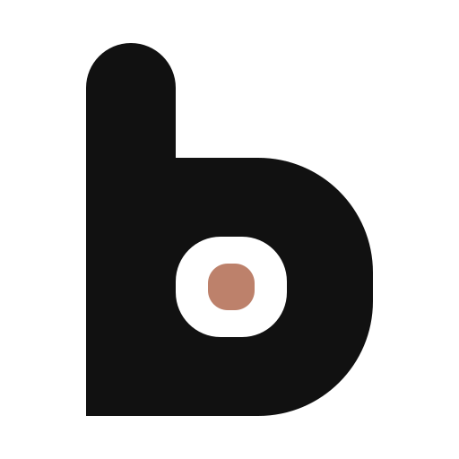

<p align="center">
  <picture>
    <source media="(prefers-color-scheme: dark)" srcset=".github/assets/logo-dark.svg">
    
  </picture>
</p>

<h1 align="center">brand-design · 品牌设计</h1>

<p align="center">用于 Logo 设计、品牌语言、可编辑品牌物料和开发视觉交接的 Agent Skill。</p>

<p align="center"><a href="README.md">English</a> · <b>简体中文</b></p>

---

`brand-design` 约束 AI 编程 Agent 完成品牌设计工作：设计或迭代 Logo，从参考中提取视觉方法，验证字体，建立品牌语言与手册，制作可编辑的品牌物料，再把品牌参数以 tokens、字体配置和组件状态示例的形式交给开发。Agent 可以从新简报开始，也可以接着已有成果做，只执行你要求的阶段。

## 覆盖的任务

| 任务 | Agent 的入口 |
| --- | --- |
| 新 Logo、已有方向继续、方向比较与迭代 | [Logo 流程](references/flow-logo.md) |
| 按参考图或指定的视觉方法做 | [BD-REF-001](references/design.md#bd-ref-001) + [风格索引](libraries/styles/INDEX.md) |
| 字标、字体搭配、中英文排版 | [BD-TYPE-001](references/assets.md#bd-type-001) + [字体索引](libraries/fonts/INDEX.md) |
| 已有自有 Logo，只改配色或材质 | [BD-EDIT-001](references/design.md#bd-edit-001)、[BD-MATERIAL-001](references/design.md#bd-material-001) |
| SVG/PNG 母版、favicon 与基础资产交付 | [BD-MASTER-001](references/assets.md#bd-master-001) + [交付合同](references/validation-contract.md) |
| 品牌语言、品牌手册、辅助图形与真实物料 | [品牌系统流程](references/flow-system.md) + [应用模板库](libraries/applications/INDEX.md) |
| 开发视觉规范、tokens、字体与资产配置、组件状态 | [开发视觉交接流程](references/flow-handoff.md) + [Web 消费验证](references/handoff-web.md) |

业务需求、页面导航、API 与产品代码不在范围内，交给对应任务处理。

## 工作方式

每个方向、版本和改动都用稳定 ID 记录，同时保存完整 Prompt、每张参考图及其角色（构思、形状、材质、排版或应用）、输出路径和反馈。新方向必须在意象、轮廓或内部构造上有实质差异，换色或换背景不算新构思。

正式 Logo 要建立由真实路径构成的可编辑母版。位图嵌进 SVG 不算矢量化，生图结果也不能当作可信的矢量母版、正确文字或真实透明背景。所有导出都从这一份母版生成，光学校正版和材质版单独标注，承诺的每个文件都必须实际存在且可读。

机械检查、视觉目检和行为测试分开报告。小尺寸、单色与反白、深浅底、拼写和真实应用都在实际产物上核对，校验器通过不能报告成视觉通过。

## 目录内容

```text
SKILL.md                 入口：任务路由与工作规则
references/              13 张规则卡（BD-*）、流程与交付合同
libraries/styles/        16 个风格包、198 个参考样本，逐图记录来源
libraries/fonts/         Space Grotesk、Noto Sans SC、JetBrains Mono（OFL）及一组已测搭配
libraries/prompts/       Prompt 模式：新构思、轮廓细化、材质配色、字标、应用展示
libraries/applications/  公告 1200×630、竖版 1080×1350、封面 1600×900 模板及渲染器
scripts/                 Skill 自检、release manifest 校验、自测、渲染器测试
agents/openai.yaml       Codex 展示元数据
AGENTS.md                维护本 Skill 时的规则
```

每个风格包都有 `STYLE.md`、`EXAMPLES.md`、`PROMPTS.md` 和 `sources.json`。16 个包的状态都是 `provisional`：参考已提取并核对，迁移到新品牌的效果尚未验证。

| 风格包 | 方法 |
| --- | --- |
| `semantic-tech-marks` | Alex Tass · 科技语义与字母融合 |
| `modern-product-wordmarks` | Mihai Dolganiuc · 现代产品字标 |
| `folded-ribbon-paths` | Dmitry Lepisov · 折带与连续路径 |
| `geometric-letter-monograms` | Jeroen van Eerden · 几何字母与组合 |
| `geometric-negative-space` | 几何负空间 |
| `monochrome-product-marks` | 黑白产品意象 |
| `soft-dimensional-symbols` | 轻立体图形 |
| `holographic-chrome-relief` | Martin Naumann · 虹彩金属浮雕，只借材质层 |
| `modernist-corporate-symbols` | Chermayeff & Geismar & Haviv · 现代主义企业符号 |
| `handwritten-script-wordmarks` | 手写与连笔字标 |
| `monoline-contour-marks` | 单线与轮廓图形 |
| `retro-skeuomorphic-marks` | 复古精密拟物 |
| `retro-badge-emblems` | 复古徽章 |
| `ornamental-folk-symbols` | Stefan Kanchev · 装饰与民艺符号 |
| `illustrative-brand-mascots` | Von Glitschka · 插画品牌角色 |
| `capsule-eye-bot-avatars` | 黑色胶囊眼极简 Bot 头像 |

## 安装

仓库约 140 MB，主要是参考图片和 Noto Sans SC 字体，建议浅克隆。

Claude Code 全局可用：

```sh
git clone --depth 1 https://github.com/Bearisbug/brand-design.git ~/.claude/skills/brand-design
```

只在单个项目中使用时，克隆到 `<项目>/.claude/skills/brand-design`。其他支持 `SKILL.md` 格式的 Agent，把目录放进该 Agent 的 skills 目录即可。

## 依赖

| 工具 | 用途 |
| --- | --- |
| Node.js 20+ | `check.sh`、校验器、物料渲染器 |
| `xmllint` | 检查时解析 SVG |
| ImageMagick 7（`magick`） | `check.sh --deep`，以及 release 校验中的 PNG 与透明度检查 |
| 浏览器 | 预览模板、导出 PNG；默认使用 Microsoft Edge |
| 生图工具（可选） | 位图探索与材质研究；矢量母版直接用 SVG 构建 |

## 用法

直接用自然语言告诉 Agent，例如：

- 「用 brand-design 给研究者笔记应用 Tidepool 探索三个 Logo 方向。」
- 「方向 B v2 的造型不动，只试一版低饱和的绿色。」
- 「给选定的标志建 SVG 母版，导出 SVG、PNG 和 favicon。」
- 「把品牌手册转成网页项目的 design tokens 和字体配置，附按钮状态示例。」

## 校验

在 Skill 根目录执行：

```sh
./check.sh                                          # Skill 资源：链接、规则卡、catalog、来源、SHA-256
./check.sh --deep                                   # 额外解码位图
node scripts/validate-release.mjs /abs/path/to/release/manifest.json
node scripts/self-test.mjs --output /abs/path/to/validation-results.json
node --test scripts/test-application-renderer.mjs
```

每条命令输出 JSON，机械检查通过时退出码为 0。通过不代表视觉质量、原创性、字体加载或许可有效性已经验证。

## 许可

原创文本、脚本、模板与 Logo 采用 [MIT 许可](LICENSE)。随附字体（SIL OFL 1.1）、胶囊眼 Bot Prompt（CC BY-NC 4.0）与第三方参考图片沿用各自条款，详见 [NOTICE](NOTICE.md)。权利人可以提交 issue，要求移除图片或更正署名。

Logo 把同一个圆角方形嵌套了三次，分别作字碗、字腔和强调色块，对应「一份母版，任何尺寸都成立」。
