# 胶囊眼 Bot 头像 · 网站示例

来源：[Grokbot Icon Studio](https://grokbot-icon-studio.serio-ai.chatgpt.site/en)。2026-09-23 用 Microsoft Edge 实际查看，按网站分组收录 **短提示词 5 张、完整提示词 5 张**。主展示区重复的粉发图不重复计数。这是 10 张来源输出，不代表 10 个独立品牌或已核实的角色身份。

所有文件为网站实际提供的 **1254×1254 原图**，已逐张目检，轮廓、眼睛与关键附件清楚；没有 AI 重绘或放大补细节。总览仅等比缩小排版。源文件、SHA-256 与页面标签见 [sources.json](sources.json)，采集上下文见 [页面截图](references/source-page.png)。

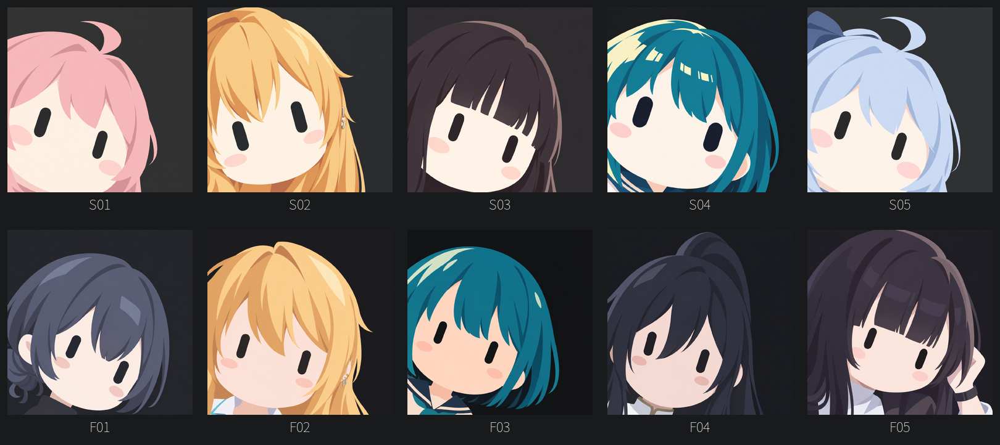

网站示例并不全部满足用户提供的完整规范：反向倾斜、露手、较多衣装、未触底下巴和柔和渐变均按实际图像注明。图片承担风格观察，不覆盖 [STYLE.md](STYLE.md) 的制作要求。没有原输入图，不能验证身份、肤色或配饰是否忠于原对象。作者及许可边界见 [SOURCE.md](SOURCE.md)；网站提示词许可不自动覆盖示例图片。

## 短提示词结果

### S01 · 粉发与上翘发束

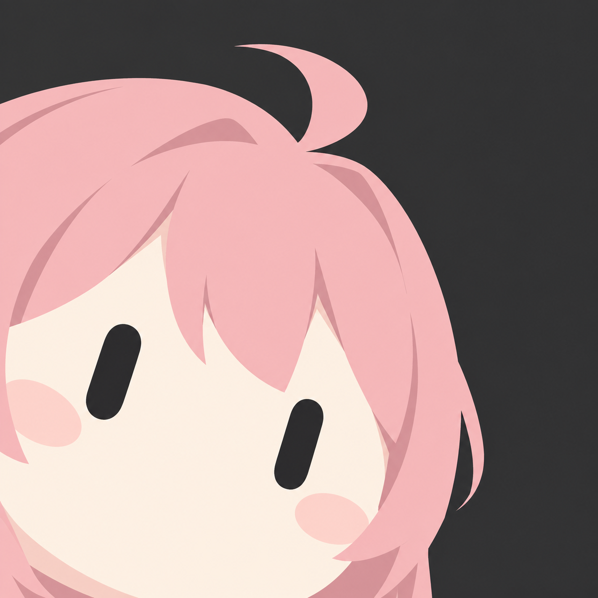

[网站原图](https://grokbot-icon-studio.serio-ai.chatgpt.site/images/pink.png) · [本地原图](references/pink.png)

**可见观察：** 粉色侧分发块、顶部弯曲发束，双眼露出，左下裁切突出。背景与头发可见柔和明暗。

**迁移建议：** 以发流和一处醒目外轮廓保留身份；不把粉发作为固定配色。

### S02 · 金发与耳饰

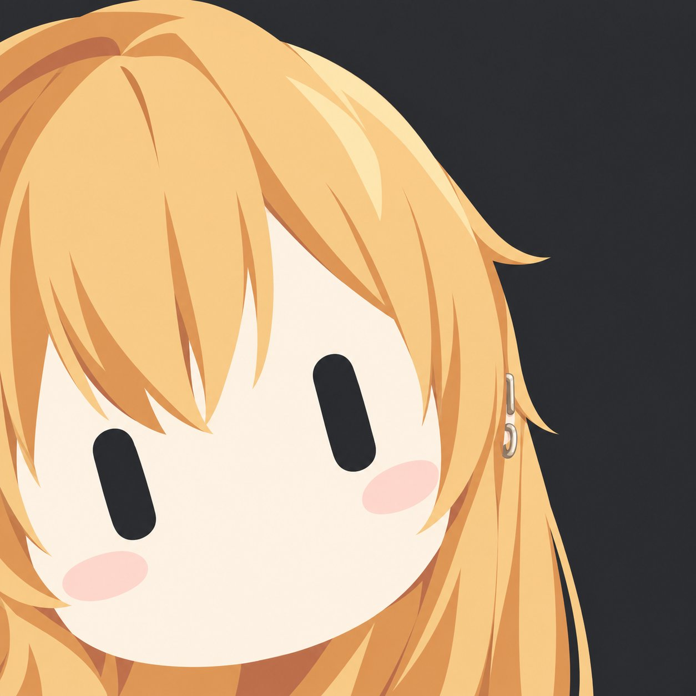

[网站原图](https://grokbot-icon-studio.serio-ai.chatgpt.site/images/blonde.jpg) · [本地原图](references/blonde.jpg)

**可见观察：** 金色长发和小耳饰，两个黑胶囊眼；画面左眼低于右眼，与完整规范的倾斜方向相反，下巴完整可见。

**迁移建议：** 研究大块金发与少量饰物；执行时按用户规范调整倾斜和裁切，不照搬反向构图。

### S03 · 深发齐刘海

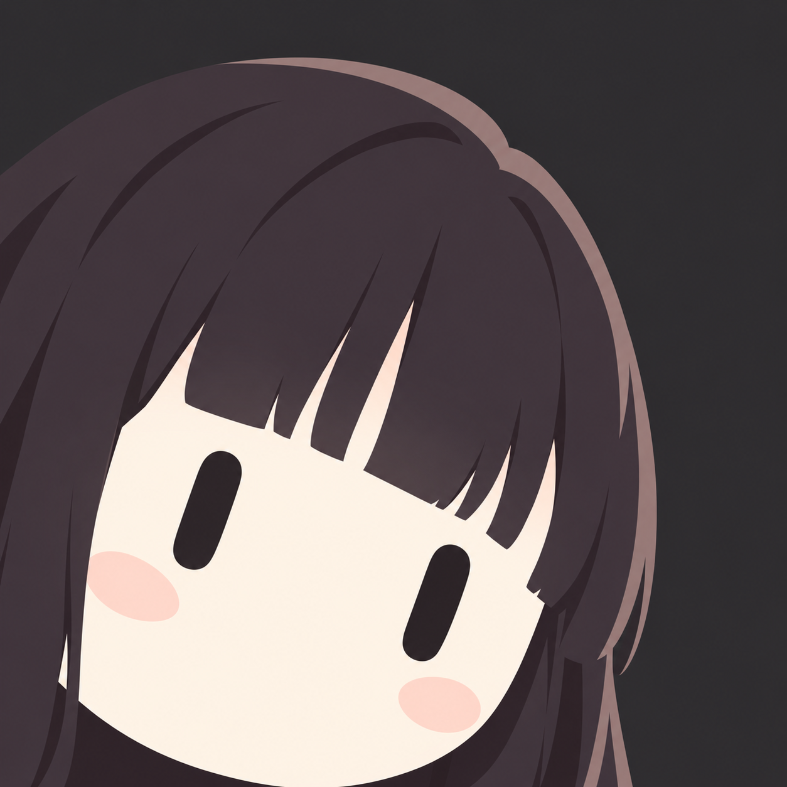

[网站原图](https://grokbot-icon-studio.serio-ai.chatgpt.site/images/black.png) · [本地原图](references/black.png)

**可见观察：** 深色长发、整齐刘海分块，双眼清楚，圆下巴在底边附近；发色与背景有低对比层次。

**迁移建议：** 以刘海整体边界而非碎发区分身份，防止深发与背景融为一块。

### S04 · 青发与大高光

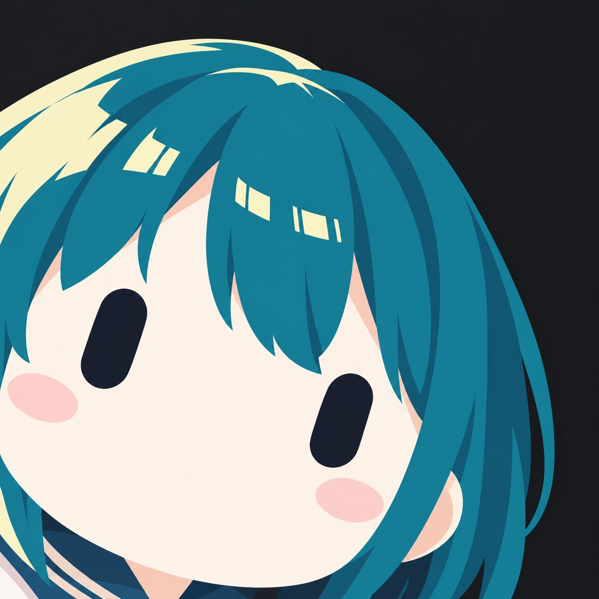

[网站原图](https://grokbot-icon-studio.serio-ai.chatgpt.site/images/teal.jpg) · [本地原图](references/teal.jpg)

**可见观察：** 青色短发、浅色块状高光，脸部占比大，底部可见颈部与衣领；高光分段较多。

**迁移建议：** 借鉴发型大轮廓与色面分区；按规范将高光收敛到一两块，不照搬多段亮片。

### S05 · 浅蓝发与蝴蝶结

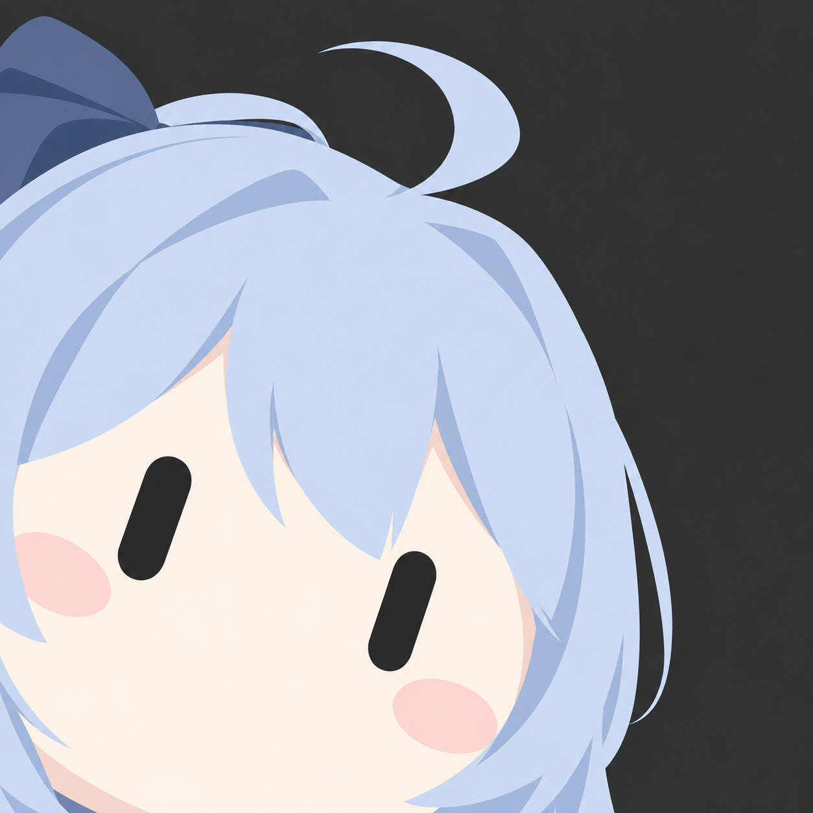

[网站原图](https://grokbot-icon-studio.serio-ai.chatgpt.site/images/blue.png) · [本地原图](references/blue.png)

**可见观察：** 浅蓝头发、上翘发束和左上深蓝蝴蝶结，双眼露出，左下紧裁切。

**迁移建议：** 仅在对象原图确有蝴蝶结和发束时保留，用附件大轮廓建立识别。

## 完整提示词结果

### F01 · 深蓝短发

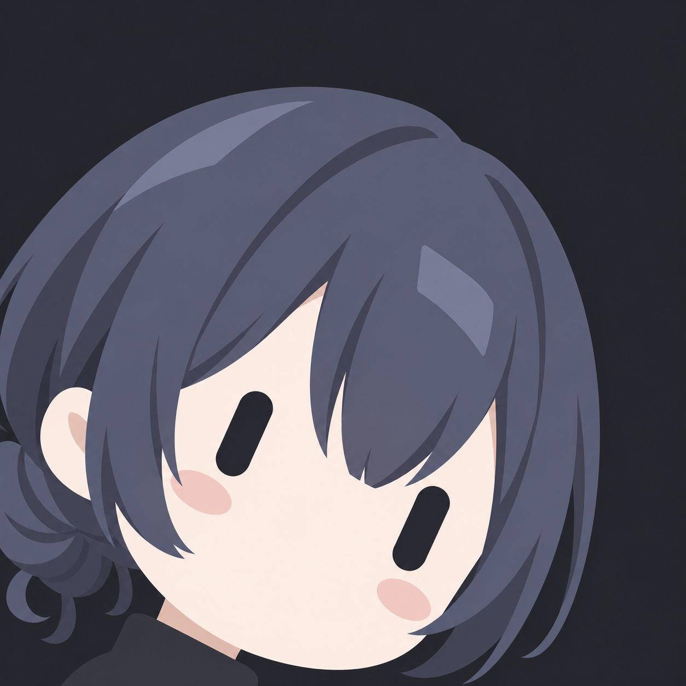

[网站原图](https://grokbot-icon-studio.serio-ai.chatgpt.site/images/full/dark-bob.png) · [本地原图](references/full-dark-bob.png)

**可见观察：** 深蓝短发与侧边卷起发尾，眼睛避开斜刘海，脸下方出现黑衣领；下巴完整入框。

**迁移建议：** 用发尾轮廓区分短发，注意生成时按规范让下巴触底而非自动缩小整头。

### F02 · 金发与小耳饰

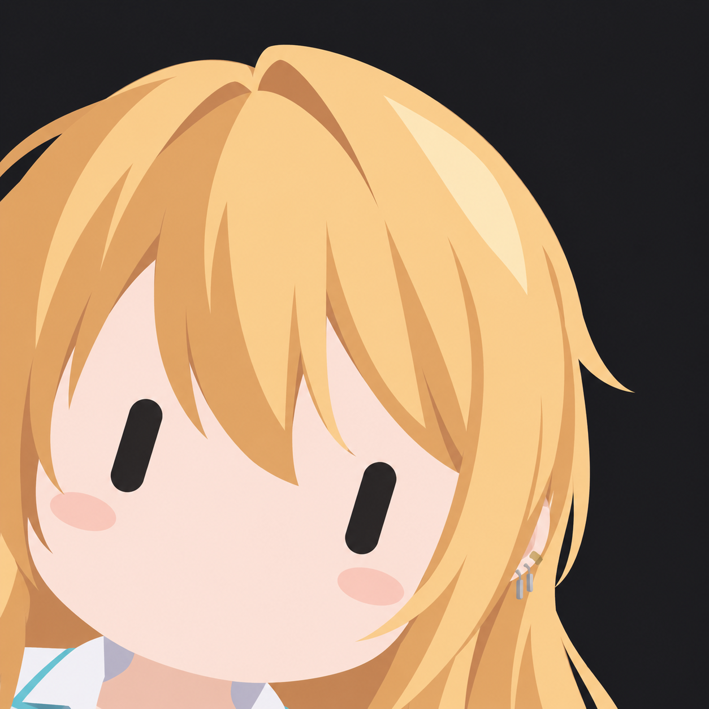

[网站原图](https://grokbot-icon-studio.serio-ai.chatgpt.site/images/full/blonde.png) · [本地原图](references/full-blonde.png)

**可见观察：** 金色长发、右侧小耳饰，左眼高于右眼；底部可见白色衣领，面颊与头发有柔和渐变。

**迁移建议：** 研究饰物保留与眼睛避让；阴影和衣领占比按本包规范控制。

### F03 · 青色短发

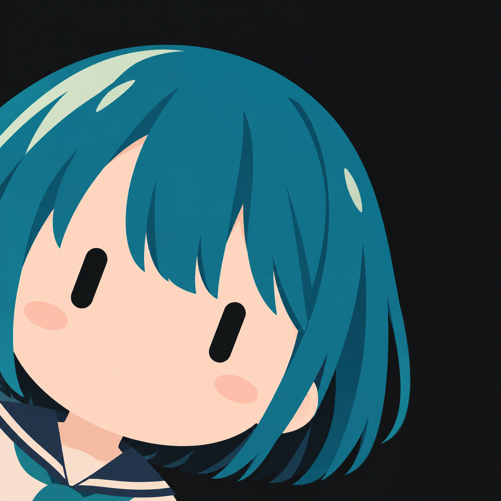

[网站原图](https://grokbot-icon-studio.serio-ai.chatgpt.site/images/full/teal.png) · [本地原图](references/full-teal.png)

**可见观察：** 青发整体块面与少量浅色高光，双眼露出；颈部和水手式衣领占据较大底部区域，下巴未触底。

**迁移建议：** 保留对象发色与剪影，制作头像时放大脸部并减少服装面积。

### F04 · 深色高马尾

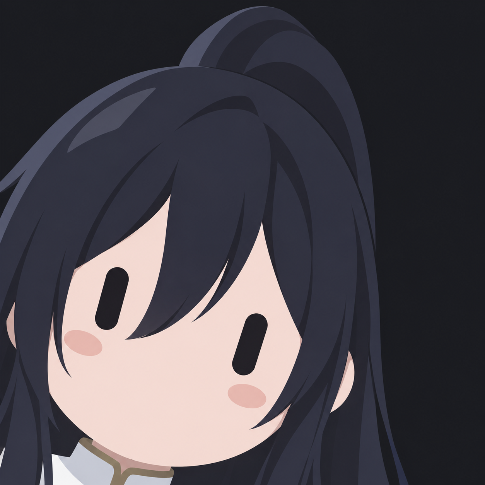

[网站原图](https://grokbot-icon-studio.serio-ai.chatgpt.site/images/full/ponytail.png) · [本地原图](references/full-ponytail.png)

**可见观察：** 高马尾、侧分长刘海与浅色领口，双眼完整；右上仍留深底，马尾轮廓成为主要识别点。

**迁移建议：** 以马尾的大连接和外形保留身份，不因装饰显著而遮住双眼。

### F05 · 齐刘海与抬手

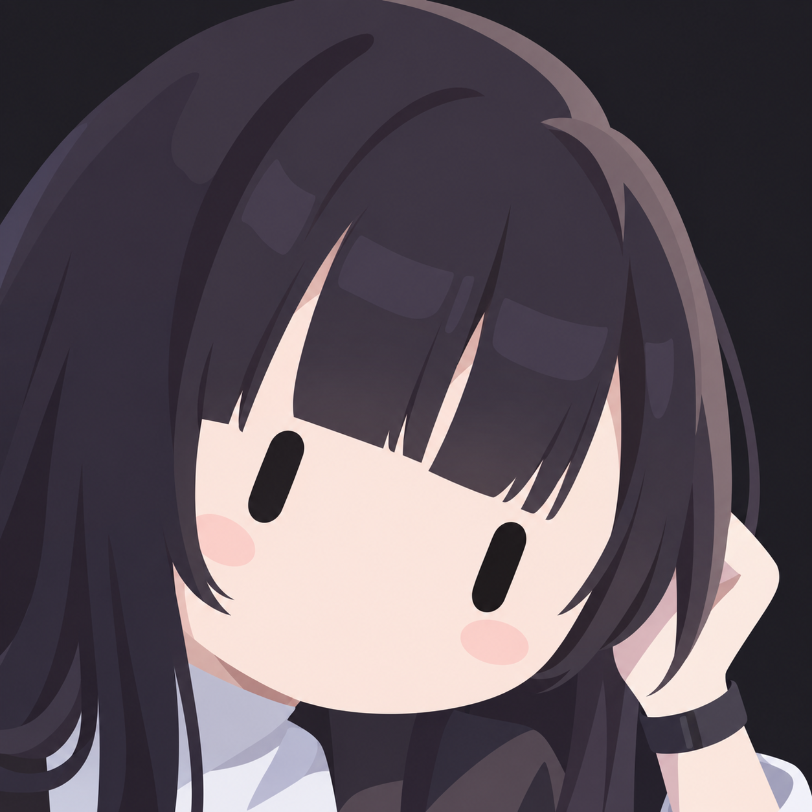

[网站原图](https://grokbot-icon-studio.serio-ai.chatgpt.site/images/full/black.png) · [本地原图](references/full-black.png)

**可见观察：** 深发齐刘海与两只黑胶囊眼；右侧明显出现手、手腕和衣袖，底部衣装面积较大，与排除手和躯干的要求不一致。

**迁移建议：** 可研究齐刘海与长发轮廓；不将手势和大面积衣装迁移到本包规范输出。
