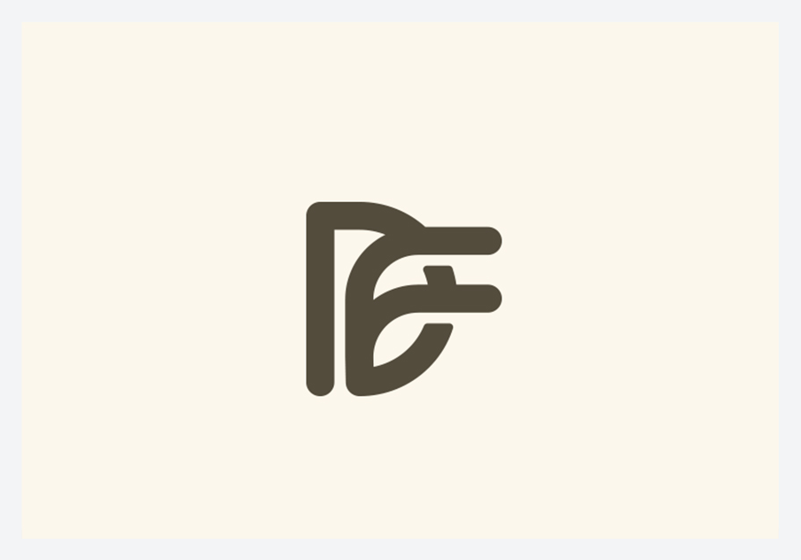
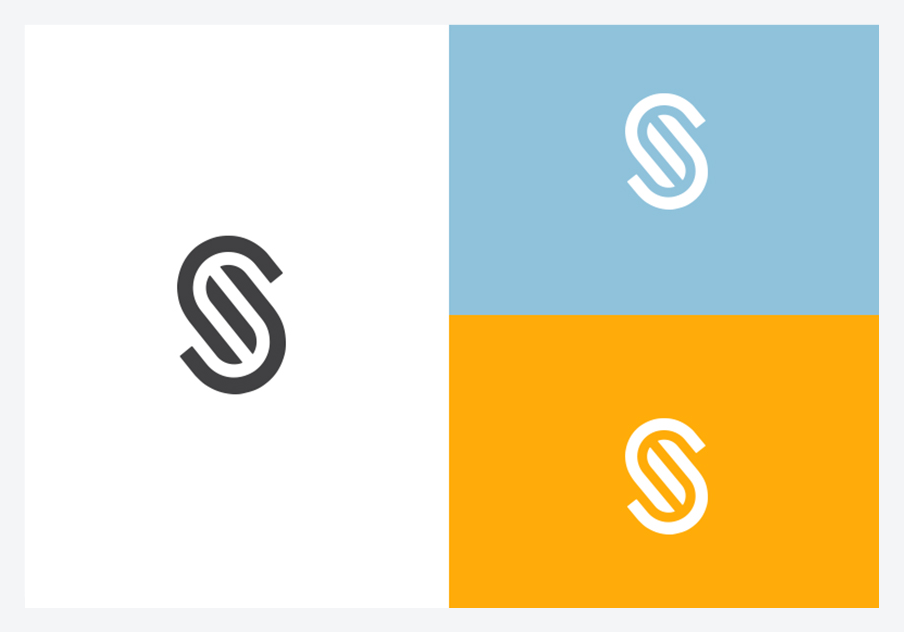
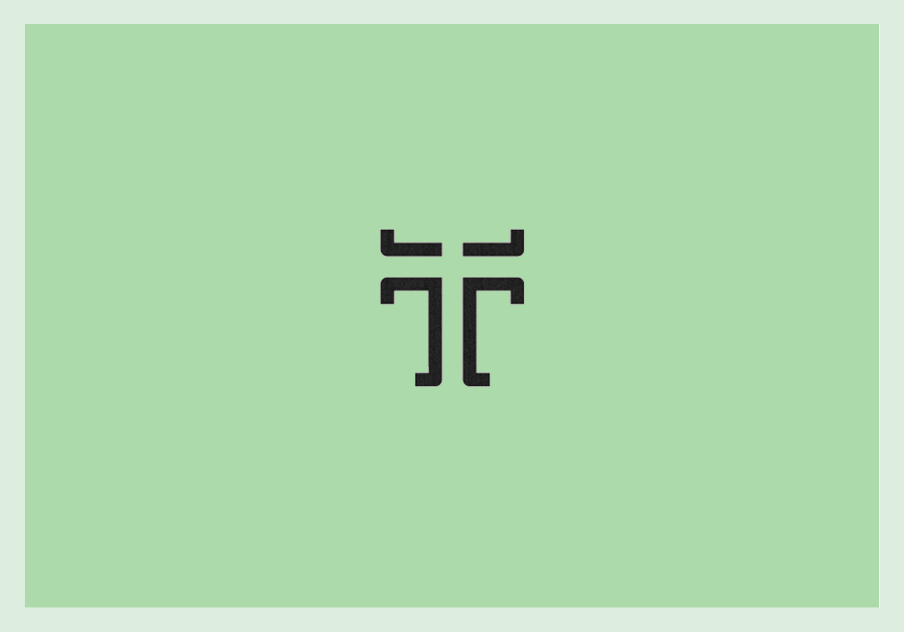
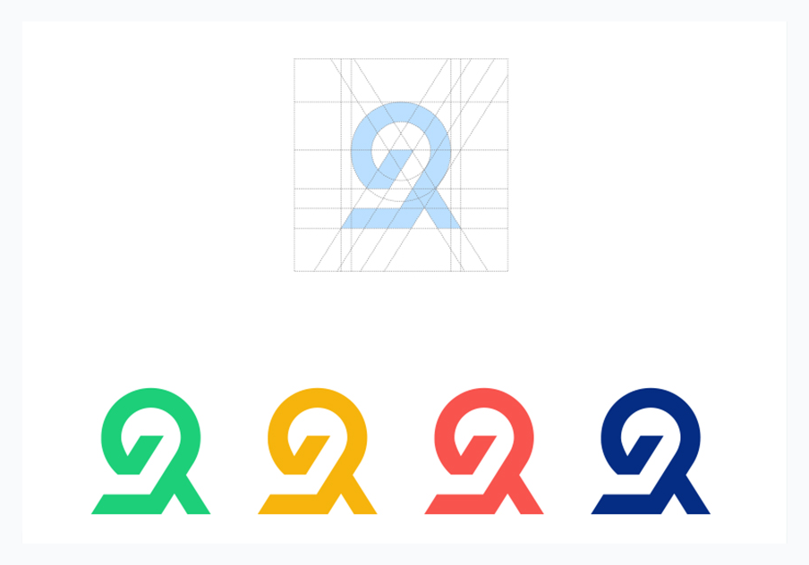
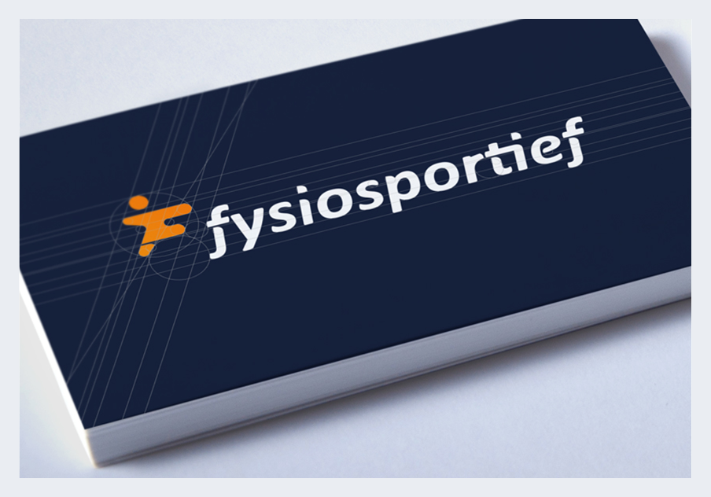
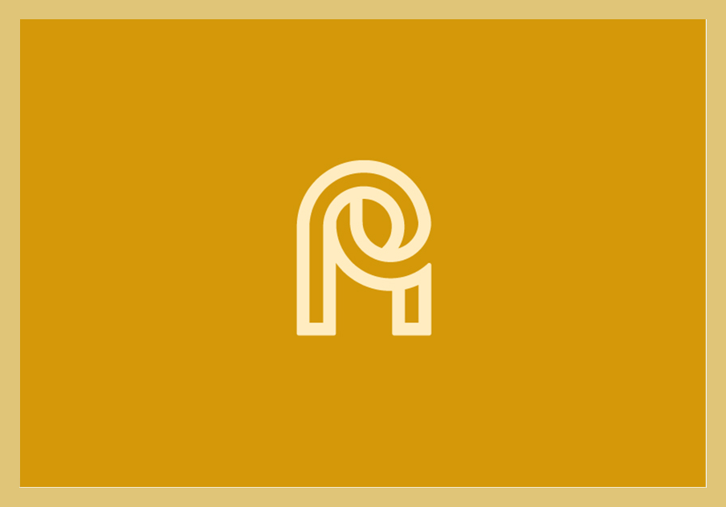

# Jeroen van Eerden · 几何字母与组合参考

本页展示第三方来源作品，不是 Agent 新生成样张。计数：10 个字母图形条目；同一条目的色版、网格与组合只计一次。每例保留来源与默认展示入口；来源版本和本库裁切不重复计数。

[风格方法](STYLE.md) · [Prompt](PROMPTS.md) · [完整来源记录](sources.json)

## J01 · DF Monogram

[打开单例](references/J01.png) · [完整预览](references/J-board-preview.png) · [原采集文件](references/J-board-original.jpg) · [来源页面](https://www.behance.net/gallery/23218943/Monograms-and-Symbols)

- 观察：D 与 F 由圆头笔画共享竖向骨架，右向横画伸出轮廓。
- 迁移：先安排主竖干和字腔，再让次字母通过短横画出现。
- 归属与状态：作者署名 Jeroen van Eerden；名称沿用图板；客户采用状态未逐项核实。
- 图像：来源解码后裁切，保持主体像素；未使用 AI 清晰化。

## J02 · S Monogram

[打开单例](references/J02.png) · [完整预览](references/J-board-preview.png) · [原采集文件](references/J-board-original.jpg) · [来源页面](https://www.behance.net/gallery/23218943/Monograms-and-Symbols)

- 观察：S 以成对平行曲线盘绕，上下开口错位。
- 迁移：控制开口与双轨间距；不要把盘绕关系直接搬到不兼容字母。
- 归属与状态：作者署名 Jeroen van Eerden；名称沿用图板；客户采用状态未逐项核实。
- 图像：来源解码后裁切，保持主体像素；未使用 AI 清晰化。

## J03 · D Monogram

[打开单例](references/J03.png) · [完整预览](references/J-board-preview.png) · [原采集文件](references/J-board-original.jpg) · [来源页面](https://www.behance.net/gallery/23218943/Monograms-and-Symbols)

- 观察：圆弧 D 外框内还有一条直立结构，图板并列显示网格与色版。
- 迁移：先解决外框与内部竖画的关系，再微调曲线和空隙。
- 归属与状态：作者署名 Jeroen van Eerden；名称沿用图板；客户采用状态未逐项核实。
- 图像：来源解码后裁切，保持主体像素；未使用 AI 清晰化。

## J04 · Unii

[打开单例](references/J04.png) · [完整预览](references/J-board-preview.png) · [原采集文件](references/J-board-original.jpg) · [来源页面](https://www.behance.net/gallery/23218943/Monograms-and-Symbols)

- 观察：U 形路径上方有两个圆点，组合中保留拟人化阅读。
- 迁移：只有字母和品牌语义支持时加入圆点，避免无依据附加笑脸。
- 归属与状态：作者署名 Jeroen van Eerden；名称沿用图板；客户采用状态未逐项核实。
- 图像：来源解码后裁切，保持主体像素；未使用 AI 清晰化。

## J05 · T Monogram

[打开单例](references/J05.png) · [完整预览](references/J-board-preview.png) · [原采集文件](references/J-board-original.jpg) · [来源页面](https://www.behance.net/gallery/23218943/Monograms-and-Symbols)

- 观察：T 由分离的横端和竖干形成，中部间隙清楚。
- 迁移：通过短横端、折角和间隙组织对称关系，检查缩小可读性。
- 归属与状态：作者署名 Jeroen van Eerden；名称沿用图板；客户采用状态未逐项核实。
- 图像：来源解码后裁切，保持主体像素；未使用 AI 清晰化。

## J06 · U Monogram

[打开单例](references/J06.png) · [完整预览](references/J-board-preview.png) · [原采集文件](references/J-board-original.jpg) · [来源页面](https://www.behance.net/gallery/23218943/Monograms-and-Symbols)

- 观察：嵌套的 U 形双轨形成圆底与开放顶部。
- 迁移：让内外 U 的间距连续，避免底部压扁或交汇。
- 归属与状态：作者署名 Jeroen van Eerden；名称沿用图板；客户采用状态未逐项核实。
- 图像：来源解码后裁切，保持主体像素；未使用 AI 清晰化。

## J07 · R Monogram

[打开单例](references/J07.png) · [完整预览](references/J-board-preview.png) · [原采集文件](references/J-board-original.jpg) · [来源页面](https://www.behance.net/gallery/23218943/Monograms-and-Symbols)

- 观察：环形上部与斜腿结合，图板展示网格和四种颜色。
- 迁移：先检查 R 的环与腿关系，色版不重复算新的构思。
- 归属与状态：作者署名 Jeroen van Eerden；名称沿用图板；客户采用状态未逐项核实。
- 图像：来源解码后裁切，保持主体像素；未使用 AI 清晰化。

## J08 · F Monogram — fysiosportief

[打开单例](references/J08.png) · [完整预览](references/J-board-preview.png) · [原采集文件](references/J-board-original.jpg) · [来源页面](https://www.behance.net/gallery/23218943/Monograms-and-Symbols)

- 观察：斜向 F 与橙色短横构成运动感，展示于门牌组合中。
- 迁移：倾斜来自动作语义时再使用；正式形状需另外提供平视母版。
- 归属与状态：作者署名 Jeroen van Eerden；名称沿用图板；客户采用状态未逐项核实。
- 图像：来源解码后裁切，保持主体像素；未使用 AI 清晰化。

## J09 · AP Monogram

[打开单例](references/J09.png) · [完整预览](references/J-board-preview.png) · [原采集文件](references/J-board-original.jpg) · [来源页面](https://www.behance.net/gallery/23218943/Monograms-and-Symbols)

- 观察：圆弧交汇连接 A 与 P 的主要笔画，内部形成小字腔。
- 迁移：明确两字母主次，优先保持字腔与连接处的分离。
- 归属与状态：作者署名 Jeroen van Eerden；名称沿用图板；客户采用状态未逐项核实。
- 图像：来源解码后裁切，保持主体像素；未使用 AI 清晰化。

## J10 · PR Monogram

[打开单例](references/J10.png) · [完整预览](references/J-board-preview.png) · [原采集文件](references/J-board-original.jpg) · [来源页面](https://www.behance.net/gallery/23218943/Monograms-and-Symbols)

- 观察：上部双层环与下方分叉腿连成轻线性结构。
- 迁移：将环与腿的接点作为细化重点，避免读成不相关数字。
- 归属与状态：作者署名 Jeroen van Eerden；名称沿用图板；客户采用状态未逐项核实。
- 图像：来源解码后裁切，保持主体像素；未使用 AI 清晰化。

