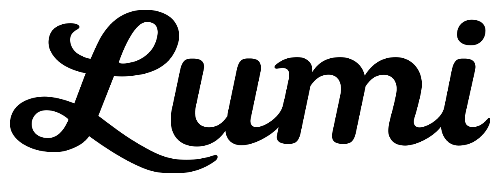
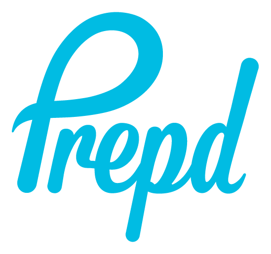
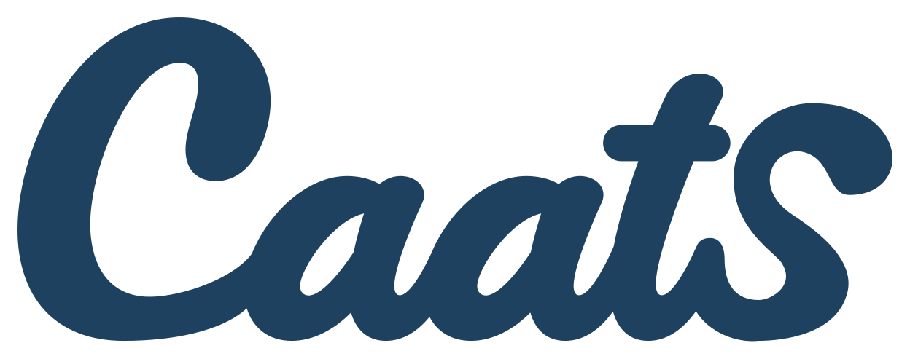
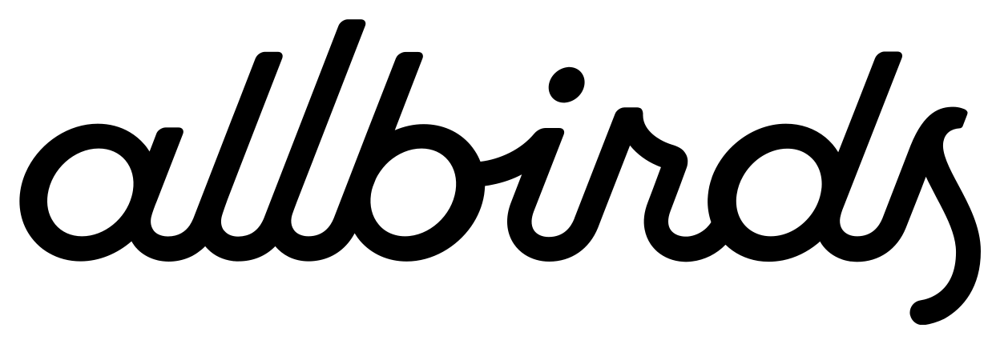
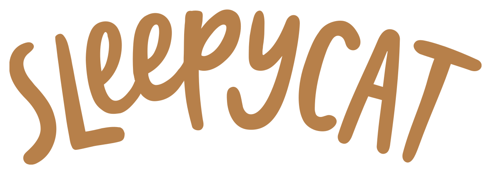
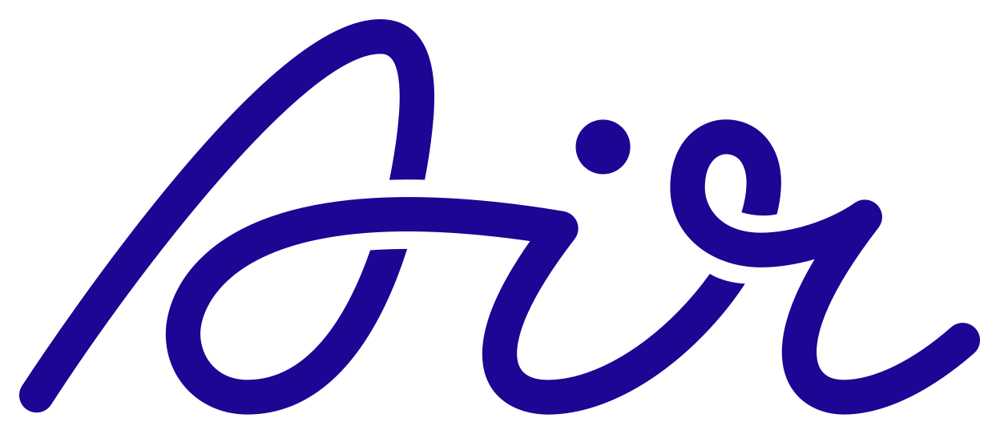
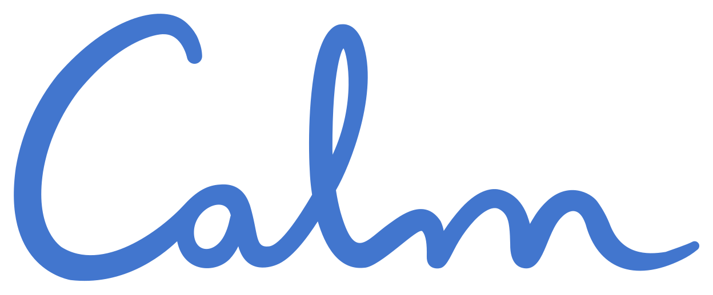

# 手写与连笔字标 · 十例参考

十例分别按品牌去重；源图、预览和裁切图不重复计数。本轮保留清晰来源，未使用 AI 清晰化。总览用于比较，逐例 PNG 与完整源文件用于看细节。

## W01 · Lumi

粗重连笔字形配大写 L 的上下环圈，首字母长尾向字底伸展。

可迁移方法：把一个显著起笔或收笔作为识别重点，其余字母维持阅读节奏。

[清晰单例](references/W01.png) · [完整源文件](references/W01-original.svg) · [来源页面](https://www.logggos.club/browse/style/script) · [站点提供的项目入口](https://www.logggos.club/logo/lumi/1php0rpouzj0rx)

作者：未核实；Logggos 为收录者。展示尺寸 1233×452，来自保留的 SVG 矢量文件。

## W02 · Vine

V 的上部环圈与后续小写笔势相接，圆点和弧形使整体显得饱满。

可迁移方法：控制单一环圈与字身的比例，避免连接后读成其他字母。

[清晰单例](references/W02.png) · [完整源文件](references/W02-original.svg) · [来源页面](https://www.logggos.club/browse/style/script) · [站点提供的项目入口](https://www.logggos.club/logo/vine/2gnxmkz3ffyvb6)

作者：未核实；Logggos 为收录者。展示尺寸 1248×510，来自保留的 SVG 矢量文件。

## W03 · Prepd

高挑首字母环圈与右端 d 竖笔包住较低的中间字身，整体明显倾斜。

可迁移方法：利用首尾高度形成张力，保持中部字母洞口清楚。

[清晰单例](references/W03.png) · [完整源文件](references/W03-original.png) · [来源页面](https://www.logggos.club/browse/style/script) · [站点提供的项目入口](https://www.logggos.club/logo/prepd/3oyid36y6ks8id)

作者：未核实；Logggos 为收录者。展示尺寸 549×515，来源文件 501×467，裁切不放大。

## W04 · Mercht

细线连笔、较大首字母与向右延伸的横向笔画形成轻盈节奏。

可迁移方法：通过笔画跨度与留白表达轻快；不依靠统一加粗。

[清晰单例](references/W04.png) · [完整源文件](references/W04-original.svg) · [来源页面](https://www.logggos.club/browse/style/script) · [站点提供的项目入口](https://www.logggos.club/logo/mercht/5dzjocoahikkxn)

作者：未核实；Logggos 为收录者。展示尺寸 1234×386，来自保留的 SVG 矢量文件。

## W05 · Caats

深蓝厚重手写体，以大写 C 的大开口带出紧密小写组合。

可迁移方法：对比首字母开口与后续紧密连接，检查相邻字母的分界。

[清晰单例](references/W05.png) · [完整源文件](references/W05-original.svg) · [来源页面](https://www.logggos.club/browse/style/script) · [站点提供的项目入口](https://www.logggos.club/logo/caats/5hpmt40ngtt9xb)

作者：未核实；Logggos 为收录者。展示尺寸 1248×493，来自保留的 SVG 矢量文件。

## W06 · Remind

斜向字标中 R 的收笔延伸到下一字母下方，正文仍维持明确字母结构。

可迁移方法：限定装饰笔画的位置，避免让每个字母都产生长尾。

[清晰单例](references/W06.png) · [完整源文件](references/W06-original.svg) · [来源页面](https://www.logggos.club/browse/style/script) · [站点提供的项目入口](https://www.logggos.club/logo/remind/bbhmjccohyjgr9)

作者：未核实；Logggos 为收录者。展示尺寸 1246×454，来自保留的 SVG 矢量文件。

## W07 · Allbirds

黑色圆润连笔呈近等粗的长短竖笔节奏，重复上伸笔画成为明显轮廓。

可迁移方法：从名称里的重复结构组织节奏，不复制原词的整体轮廓。

[清晰单例](references/W07.png) · [完整源文件](references/W07-original.svg) · [来源页面](https://www.logggos.club/browse/style/script) · [站点提供的项目入口](https://www.logggos.club/logo/allbirds/ek13ft1wymzcke)

作者：未核实；Logggos 为收录者。展示尺寸 1248×430，来自保留的 SVG 矢量文件。

## W08 · Sleepy Cat

棕色手写字形混合高低与宽窄变化，单词整体呈拱起节奏。

可迁移方法：允许不规则字面，但用基线关系与字距保证词组可读。

[清晰单例](references/W08.png) · [完整源文件](references/W08-original.svg) · [来源页面](https://www.logggos.club/browse/style/script) · [站点提供的项目入口](https://www.logggos.club/logo/sleepy-cat/ecxyoa2lddk31w)

作者：未核实；Logggos 为收录者。展示尺寸 1248×445，来自保留的 SVG 矢量文件。

## W09 · Air

少量流动线条形成大环圈、横向连接和收尾，字形与符号感接近。

可迁移方法：对短词控制环圈数量，逐字核对未因抽象而丢失拼写。

[清晰单例](references/W09.png) · [完整源文件](references/W09-original.svg) · [来源页面](https://www.logggos.club/browse/style/script) · [站点提供的项目入口](https://www.logggos.club/logo/air/ietxgkiurta2uv)

作者：未核实；Logggos 为收录者。展示尺寸 1248×542，来自保留的 SVG 矢量文件。

## W10 · Calm

蓝色细笔画与圆滑起伏构成轻松连笔，字母间过渡柔和。

可迁移方法：用笔势与曲率表达语气，同时保留低对比度背景上的可见性。

[清晰单例](references/W10.png) · [完整源文件](references/W10-original.svg) · [来源页面](https://www.logggos.club/browse/style/script) · [站点提供的项目入口](https://www.logggos.club/logo/calm/mtd7wfou2sn7cf)

作者：未核实；Logggos 为收录者。展示尺寸 1248×518，来自保留的 SVG 矢量文件。

## 使用边界

上述为可见特征的整理与评论。原字体、作者未说明的语义和具体委托/采用状态不补编；来源页的年份按其标签记录。生成迁移尚未验证。字段、文件校验与清晰度判断见 [sources.json](sources.json)，使用方法见 [STYLE.md](STYLE.md)。
