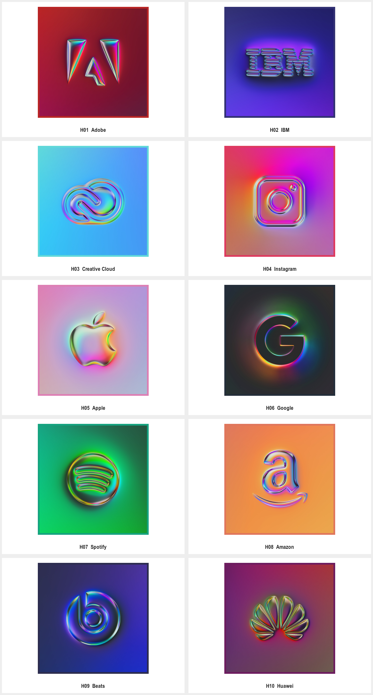
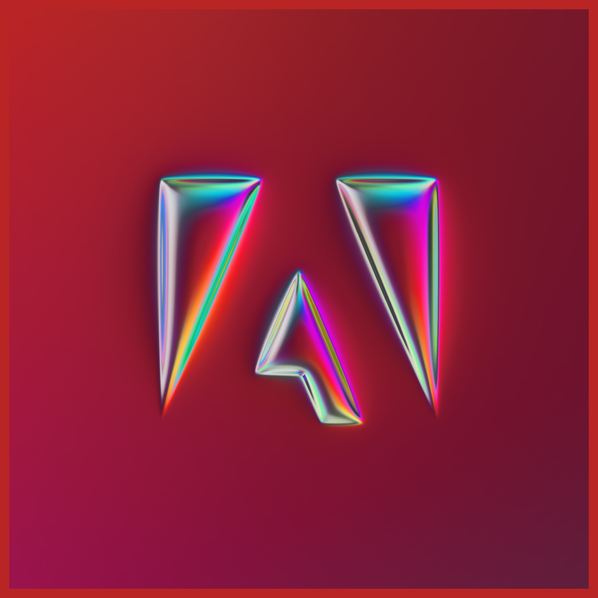
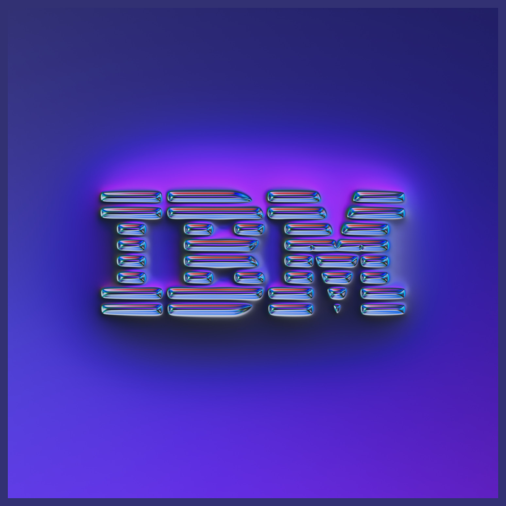
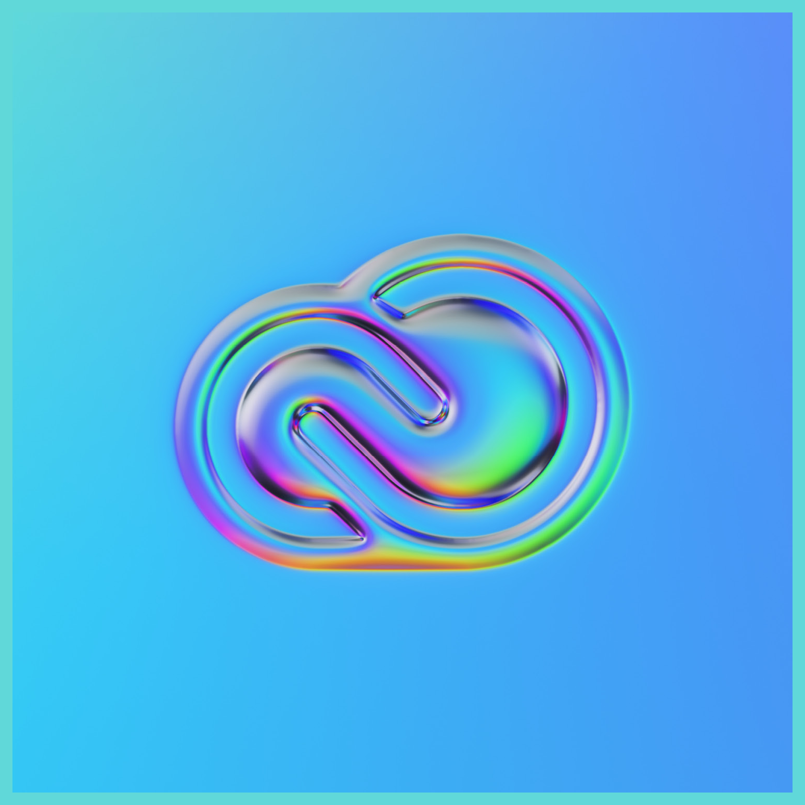
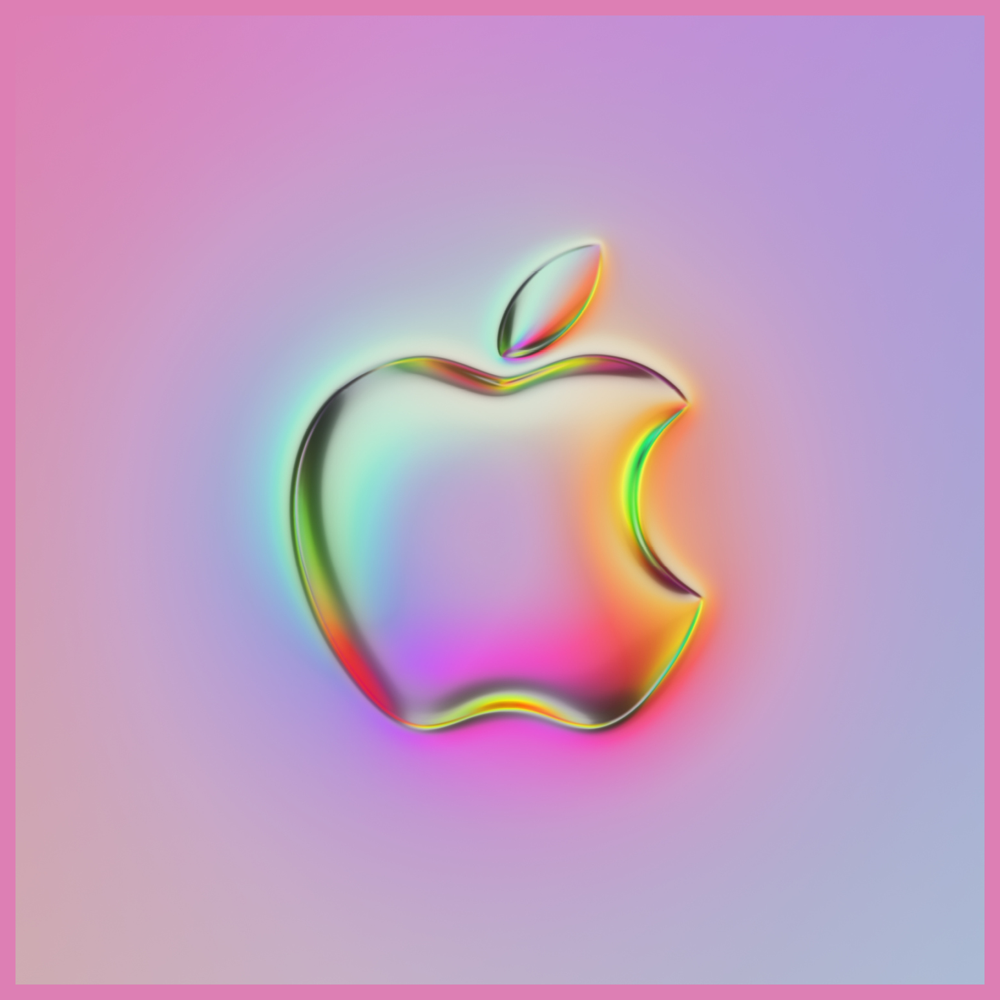
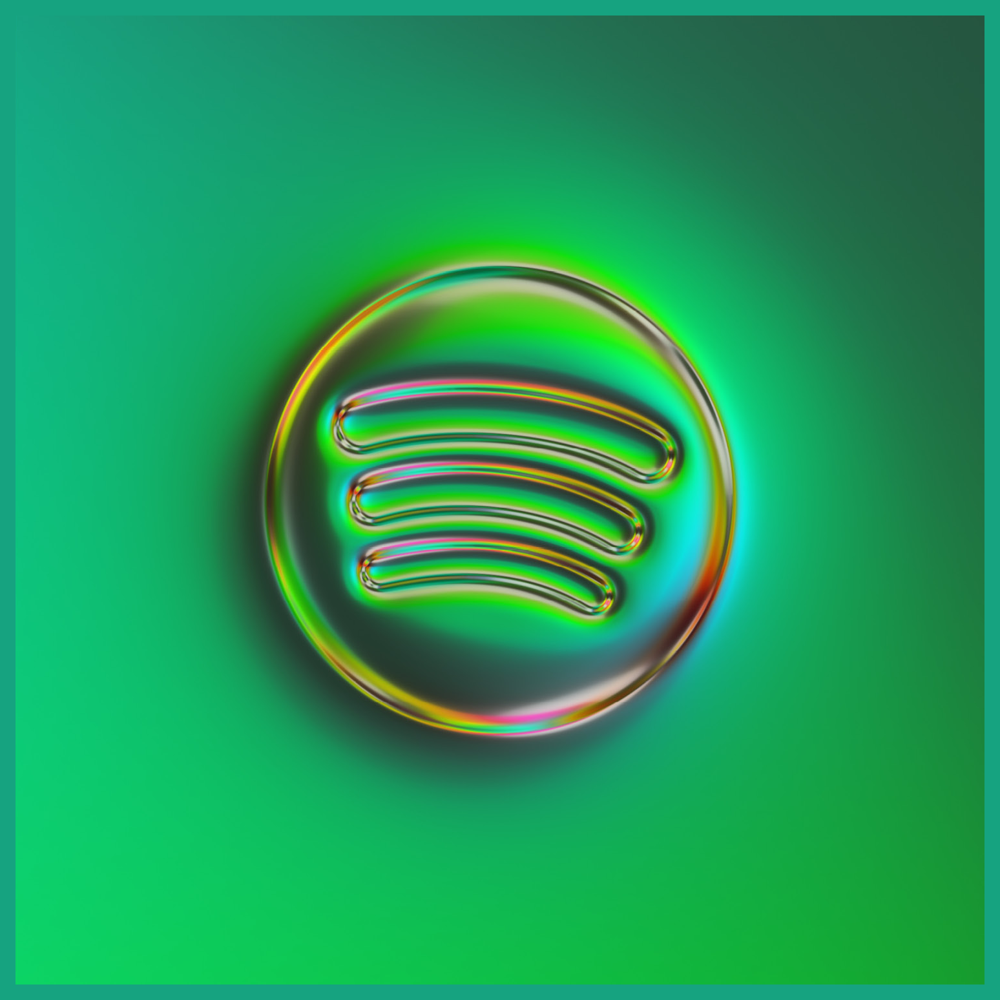
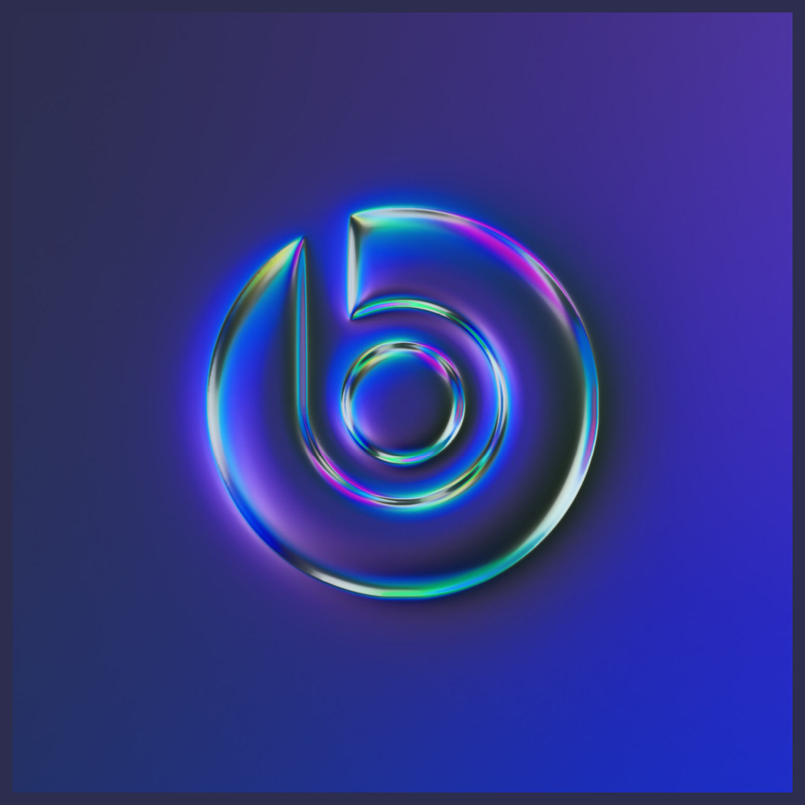
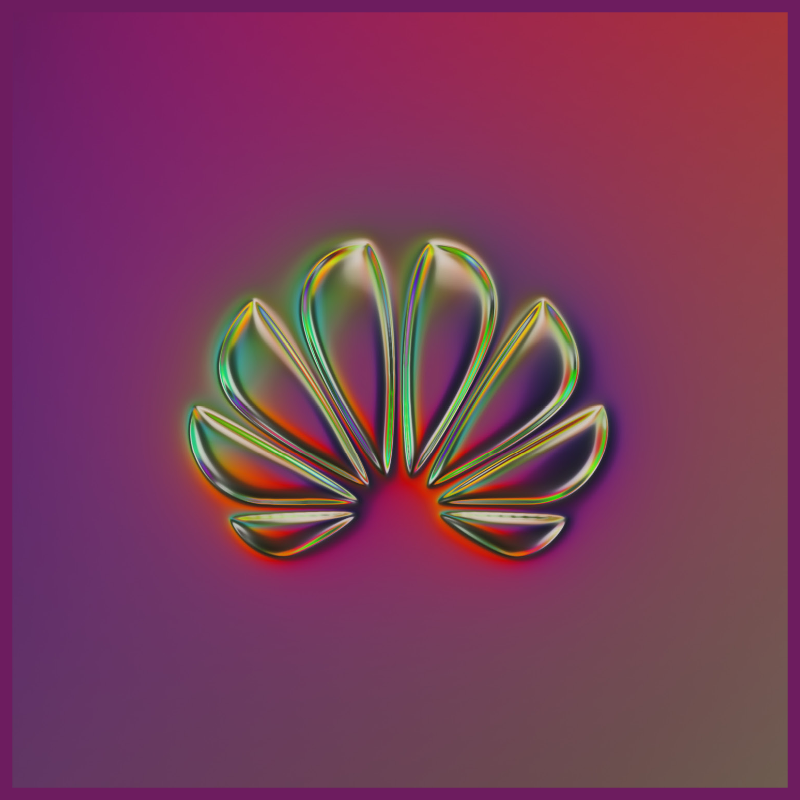

# Martin Naumann · 虹彩金属浮雕参考

本页展示第三方来源作品，不是 Agent 新生成样张。计数：同一材质系列中的 10 个既有品牌主体，不是十项客户委托；同主体应用图不重复计数。每例保留来源与默认展示入口；来源版本和本库裁切不重复计数。

[风格方法](STYLE.md) · [Prompt](PROMPTS.md) · [完整来源记录](sources.json)

## H01 · Adobe

[打开单例](references/H01.png) · [完整预览](references/H-board-5-preview.png) · [原采集文件](references/H-board-5-original.jpg) · [来源页面](https://www.behance.net/gallery/107887855/36-logos)

- 观察：三角形结构的边缘呈窄彩色金属高光，红色环境与深暗凹面形成对比。
- 迁移：在新主体的尖角与孔洞周围限制倒角厚度，先保护识别。
- 归属与状态：Martin Naumann 的个人材质再演绎；原标志归属 Adobe；不是官方改版或已确认委托。
- 图像：来源解码后裁切，保持主体像素；未使用 AI 清晰化。

## H02 · IBM

[打开单例](references/H02.png) · [完整预览](references/H-board-6-preview.png) · [原采集文件](references/H-board-6-original.jpg) · [来源页面](https://www.behance.net/gallery/107887855/36-logos)

- 观察：分条字母的每层边缘出现彩色隆起与阴影，紫蓝背景衬托条带。
- 迁移：用多条带结构试验高光是否挤占间隔；不能用材质补偿过密构造。
- 归属与状态：Martin Naumann 的个人材质再演绎；原标志归属 IBM；不是官方改版或已确认委托。
- 图像：来源解码后裁切，保持主体像素；未使用 AI 清晰化。

## H03 · Creative Cloud

[打开单例](references/H03.png) · [完整预览](references/H-board-7-preview.png) · [原采集文件](references/H-board-7-original.jpg) · [来源页面](https://www.behance.net/gallery/107887855/36-logos)

- 观察：交锁曲线呈圆润金属边缘，青蓝底面与彩色反射共同形成浅浮雕。
- 迁移：环形自有标志先固定交叠顺序，再研究反射分布。
- 归属与状态：Martin Naumann 的个人材质再演绎；原标志归属 Creative Cloud；不是官方改版或已确认委托。
- 图像：来源解码后裁切，保持主体像素；未使用 AI 清晰化。

## H04 · Instagram

[打开单例](references/H04.png) · [完整预览](references/H-board-11-preview.png) · [原采集文件](references/H-board-11-original.jpg) · [来源页面](https://www.behance.net/gallery/107887855/36-logos)

- 观察：圆角框、内圈与角落圆点保持分离，彩色边缘在粉紫背景上呈现隆起。
- 迁移：检查小孔、独立圆点与外框是否被光晕粘连。
- 归属与状态：Martin Naumann 的个人材质再演绎；原标志归属 Instagram；不是官方改版或已确认委托。
- 图像：来源解码后裁切，保持主体像素；未使用 AI 清晰化。

## H05 · Apple

[打开单例](references/H05.png) · [完整预览](references/H-board-12-preview.png) · [原采集文件](references/H-board-12-original.jpg) · [来源页面](https://www.behance.net/gallery/107887855/36-logos)

- 观察：大面积主体暗面与窄虹彩边缘结合，缺口和独立叶片被保留。
- 迁移：借鉴实心面与边缘反射的比例，不迁移苹果或叶片形状。
- 归属与状态：Martin Naumann 的个人材质再演绎；原标志归属 Apple；不是官方改版或已确认委托。
- 图像：来源解码后裁切，保持主体像素；未使用 AI 清晰化。

## H06 · Google

[打开单例](references/H06.png) · [完整预览](references/H-board-13-preview.png) · [原采集文件](references/H-board-13-original.jpg) · [来源页面](https://www.behance.net/gallery/107887855/36-logos)

- 观察：G 的宽暗面由彩色倒角包围，内外弧面和水平端点出现不同反射。
- 迁移：对自有字母形状逐段检查内外边缘，避免亮边改变开口阅读。
- 归属与状态：Martin Naumann 的个人材质再演绎；原标志归属 Google；不是官方改版或已确认委托。
- 图像：来源解码后裁切，保持主体像素；未使用 AI 清晰化。

## H07 · Spotify

[打开单例](references/H07.png) · [完整预览](references/H-board-13-preview.png) · [原采集文件](references/H-board-13-original.jpg) · [来源页面](https://www.behance.net/gallery/107887855/36-logos)

- 观察：圆形面板与内部三条弧线均有金属起伏，绿色环境光向轮廓染色。
- 迁移：比较外轮廓和内部细节的深度，确保辅助纹样不压过主体。
- 归属与状态：Martin Naumann 的个人材质再演绎；原标志归属 Spotify；不是官方改版或已确认委托。
- 图像：来源解码后裁切，保持主体像素；未使用 AI 清晰化。

## H08 · Amazon

[打开单例](references/H08.png) · [完整预览](references/H-board-3-preview.png) · [原采集文件](references/H-board-3-original.jpg) · [来源页面](https://www.behance.net/gallery/107887855/36-logos)

- 观察：小写 a 与下方弧形箭头分别呈金属边缘，橙色背景提高暖色反射。
- 迁移：多个独立部件共享光照，但分别核对它们的比例与间隔。
- 归属与状态：Martin Naumann 的个人材质再演绎；原标志归属 Amazon；不是官方改版或已确认委托。
- 图像：来源解码后裁切，保持主体像素；未使用 AI 清晰化。

## H09 · Beats

[打开单例](references/H09.png) · [完整预览](references/H-board-3-preview.png) · [原采集文件](references/H-board-3-original.jpg) · [来源页面](https://www.behance.net/gallery/107887855/36-logos)

- 观察：圆环与 b 式内形以彩色倒角和蓝紫阴影形成厚度，暗面占主要面积。
- 迁移：用高光解释曲面而非描出额外轮廓，核对内部字形仍清楚。
- 归属与状态：Martin Naumann 的个人材质再演绎；原标志归属 Beats；不是官方改版或已确认委托。
- 图像：来源解码后裁切，保持主体像素；未使用 AI 清晰化。

## H10 · Huawei

[打开单例](references/H10.png) · [完整预览](references/H-board-1-preview.png) · [原采集文件](references/H-board-1-original.jpg) · [来源页面](https://www.behance.net/gallery/107887855/36-logos)

- 观察：放射状多片轮廓各有窄彩色高光，中央汇聚处保持暗区分隔。
- 迁移：对多部件标志控制中心亮度，避免反射把各片连接成一个团块。
- 归属与状态：Martin Naumann 的个人材质再演绎；原标志归属 Huawei；不是官方改版或已确认委托。
- 图像：来源解码后裁切，保持主体像素；未使用 AI 清晰化。

