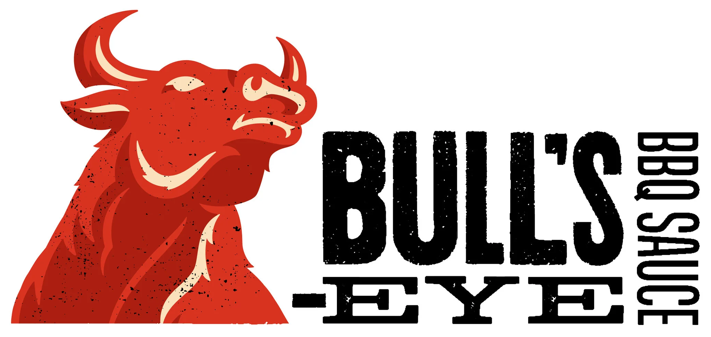
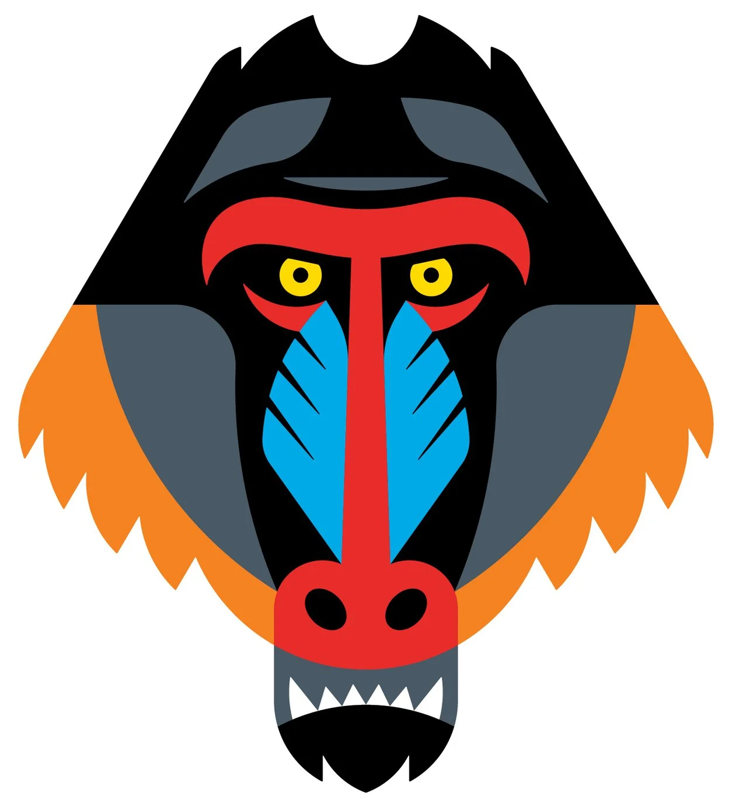
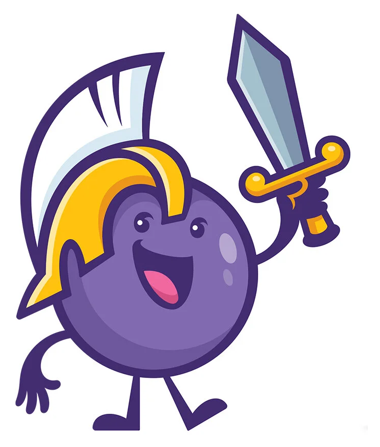
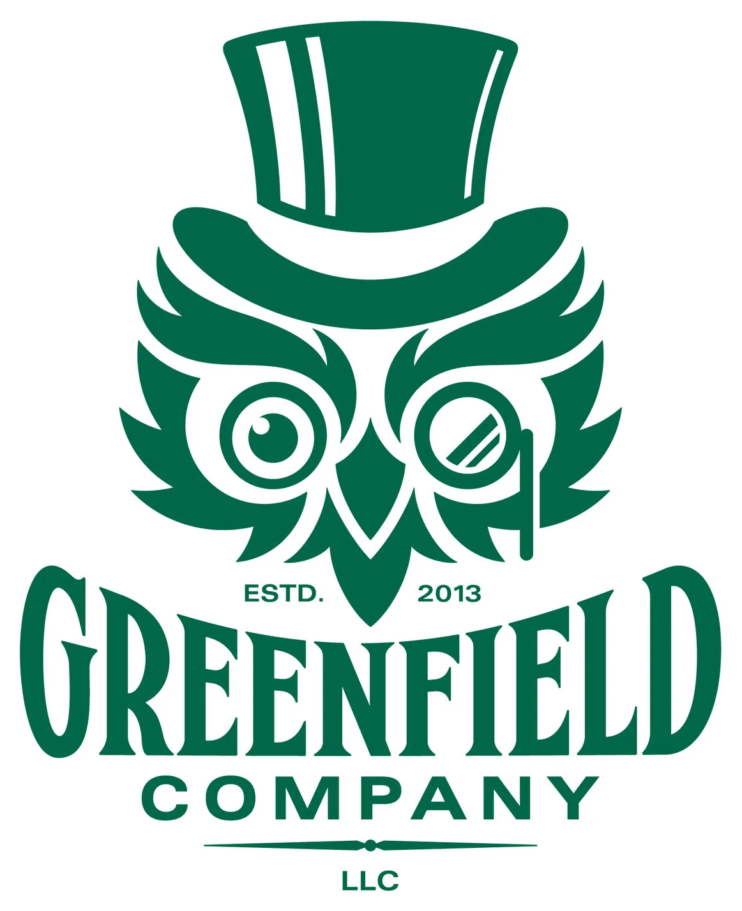
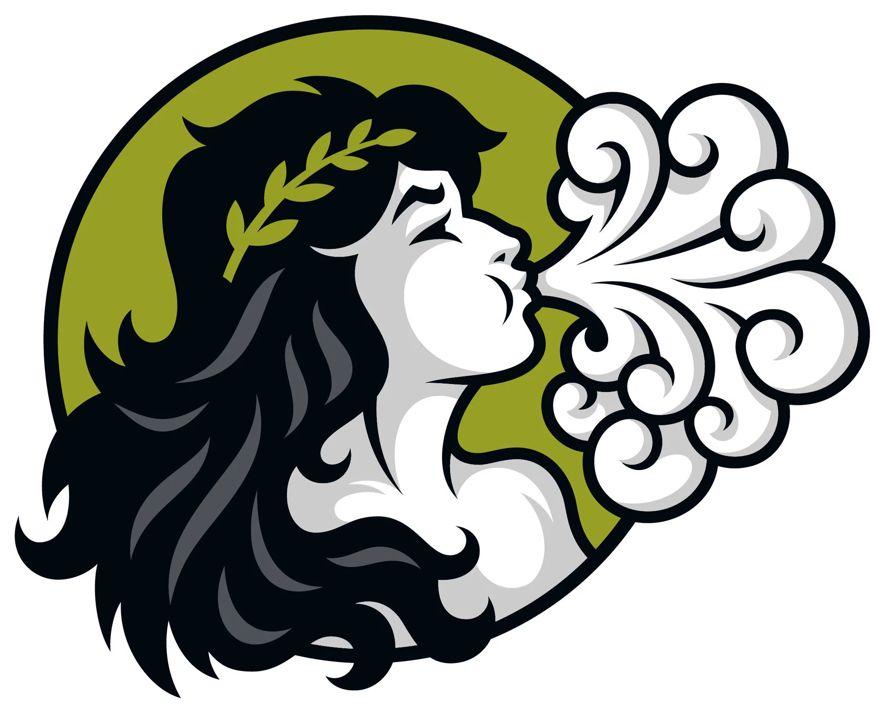
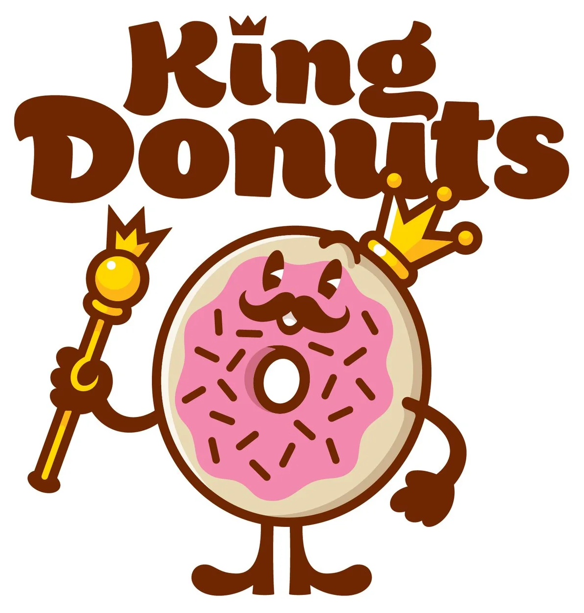
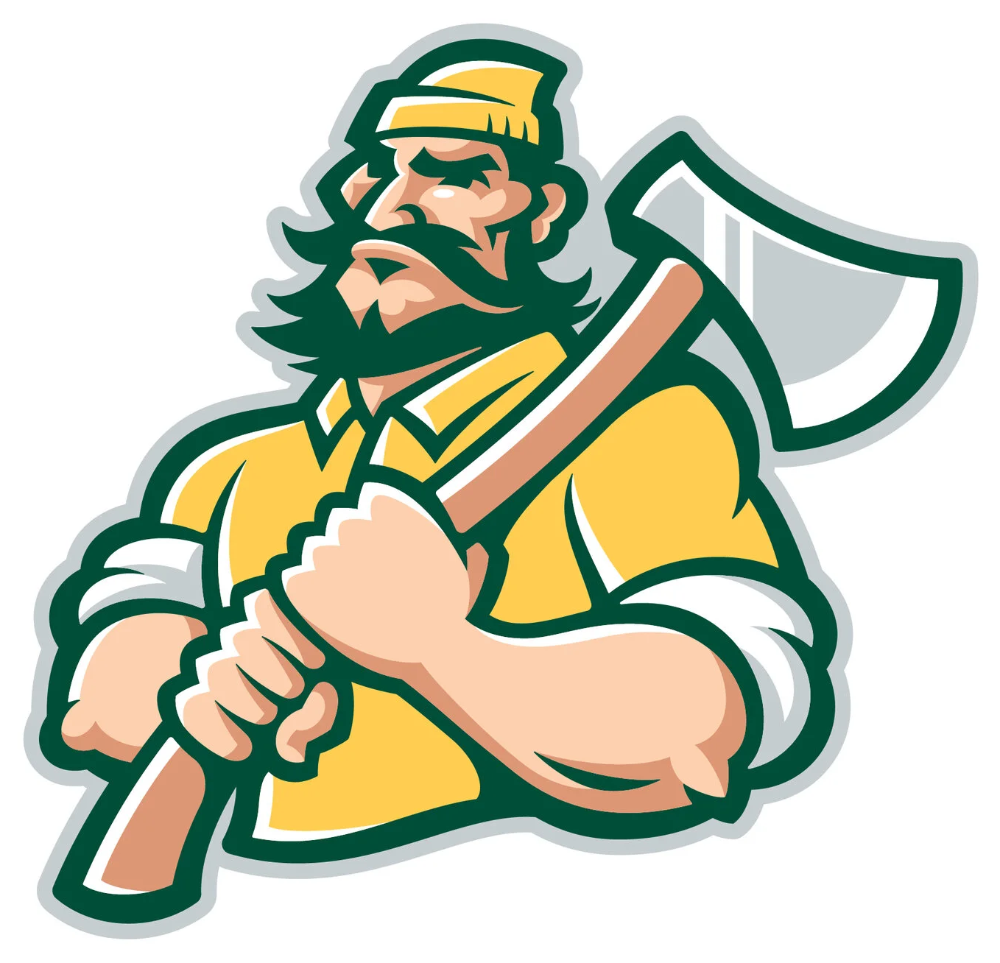
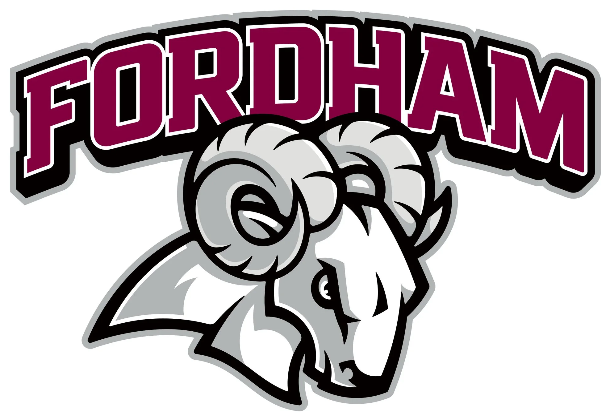
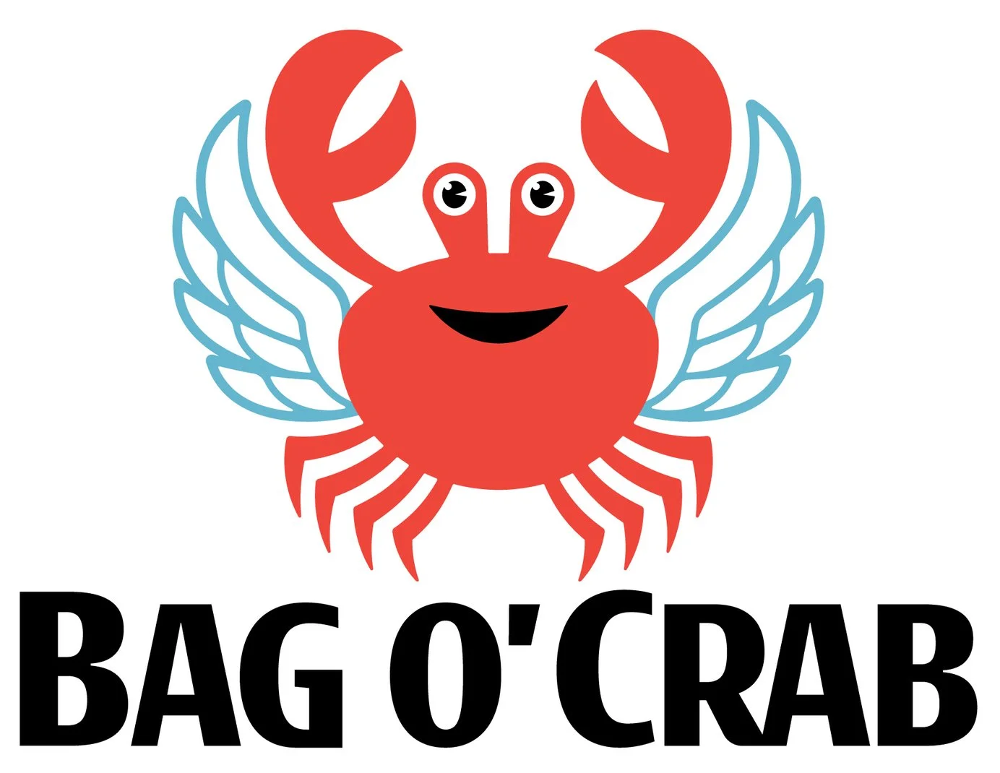

# Von Glitschka / Glitschka Studios · 插画品牌角色参考

本页展示第三方来源作品，不是 Agent 新生成样张。计数：10 个项目；角色、包装和横竖组合不重复计数。每例保留来源与默认展示入口；来源版本和本库裁切不重复计数。

[风格方法](STYLE.md) · [Prompt](PROMPTS.md) · [完整来源记录](sources.json)

## V01 · Bull’s-Eye BBQ

[打开单例](references/V01.png) · [完整预览](references/V01-src-preview.png) · [原采集文件](references/V01-src-original.webp) · [来源页面](https://www.glitschkastudios.com/work/bulls-eye-bbq)

- 观察：红色牛的仰头姿态、长角与胸颈色块形成强烈形象，黑色字标在旁。
- 迁移：先用头颈与角表达气质，再用少量明暗面强调肌肉。
- 归属与状态：角色改造；与 Landor Associates 合作，创意指导 Kindra Slivinski；不主张原品牌角色由工作室首次创造。
- 图像：来源解码后裁切，保持主体像素；未使用 AI 清晰化。

## V02 · Bad Baboon

[打开单例](references/V02.png) · [完整预览](references/V02-src-preview.png) · [原采集文件](references/V02-src-original.webp) · [来源页面](https://www.glitschkastudios.com/work/badbaboon)

- 观察：正面狒狒面孔以强对称、多色长鼻和侧边鬃毛分区。
- 迁移：先区分头、鼻和鬃毛主色，表情由眼眉关系控制。
- 归属与状态：官网标注 Rebrand / Brand Character；创意指导 Von Glitschka。
- 图像：来源解码后裁切，保持主体像素；未使用 AI 清晰化。

## V03 · 1908 Candy — Alexander the Grape

[打开单例](references/V03.png) · [完整预览](references/V03-src-preview.png) · [原采集文件](references/V03-src-original.webp) · [来源页面](https://www.glitschkastudios.com/work/1908-candy-co)

- 观察：紫色葡萄角色持剑并戴头盔，圆形身体、眼口和手脚建立人格。
- 迁移：从产品形状建立角色身体，用一个与品牌相关的身份或道具补充故事。
- 归属与状态：品牌角色改造；客户 Mann Sales Co.，创意指导 Jack Levinson；包装设计由 Mann Sales Co. 完成。
- 图像：来源解码后裁切，保持主体像素；未使用 AI 清晰化。

## V04 · Greenfield Company

[打开单例](references/V04.png) · [完整预览](references/V04-src-preview.png) · [原采集文件](references/V04-src-original.webp) · [来源页面](https://www.glitschkastudios.com/work/greenfield-company)

- 观察：戴高礼帽的猫头鹰形角色以卷曲眼部和羽片包围字标。
- 迁移：角色身份先由轮廓与道具表达，内部卷线需控制密度。
- 归属与状态：官网标注品牌识别与命名；创意指导 Von Glitschka。
- 图像：来源解码后裁切，保持主体像素；未使用 AI 清晰化。

## V05 · Tempesta Market

[打开单例](references/V05.png) · [完整预览](references/V05-src-preview.png) · [原采集文件](references/V05-src-original.webp) · [来源页面](https://www.glitschkastudios.com/work/tempesta-market)

- 观察：侧面女性头像吹出卷曲气流，头发、叶冠和背景圆块组织层级。
- 迁移：用可见动作表达抽象概念，先保证脸部与气流分离。
- 归属与状态：品牌角色/包装合作；客户 OVO / Tempesta，创意指导 Kyle Hildebrant；标签排版由 OVO 完成。
- 图像：来源解码后裁切，保持主体像素；未使用 AI 清晰化。

## V06 · AZAR Pro Services

[打开单例](references/V06.png) · [完整预览](references/V06-src-preview.png) · [原采集文件](references/V06-src-original.webp) · [来源页面](https://www.glitschkastudios.com/work/azar-pro-services)

- 观察：服务人员分别手持滚筒和清洁工具，红蓝色块与名称上下组合。
- 迁移：用少量职业道具表达服务类型，检查手部连接和工具角度。
- 归属与状态：官网标注品牌识别与命名；创意指导 Von Glitschka。
- 图像：来源解码后裁切，保持主体像素；未使用 AI 清晰化。

## V07 · King Donuts

[打开单例](references/V07.png) · [完整预览](references/V07-src-preview.png) · [原采集文件](references/V07-src-original.webp) · [来源页面](https://www.glitschkastudios.com/work/king-donuts)

- 观察：甜甜圈配皇冠、权杖和短肢体，粗字标位于上方。
- 迁移：产品主体与角色身份应共存，避免配饰盖住产品特征。
- 归属与状态：官网标注 Brand Identity Exploration，并关联课程；不声称最终商业采用已核实。
- 图像：来源解码后裁切，保持主体像素；未使用 AI 清晰化。

## V08 · Timberline Blazers

[打开单例](references/V08.png) · [完整预览](references/V08-src-preview.png) · [原采集文件](references/V08-src-original.webp) · [来源页面](https://www.glitschkastudios.com/work/timberline-high-school)

- 观察：伐木工半身抱斧，粗轮廓与肌肉、衣服的有限色面构成运动角色。
- 迁移：以肩臂和主道具确定姿态，检查小尺寸下脸和手仍清楚。
- 归属与状态：官网品牌识别项目；创意指导 Von Glitschka。
- 图像：来源解码后裁切，保持主体像素；未使用 AI 清晰化。

## V09 · Fordham University — 提案

[打开单例](references/V09.png) · [完整预览](references/V09-src-preview.png) · [原采集文件](references/V09-src-original.webp) · [来源页面](https://www.glitschkastudios.com/work/fordham-university)

- 观察：公羊头、卷角与盾状颈部配粗重弧排名称，明暗分区克制。
- 迁移：动物特征与运动字标分别建立，避免把粗描边当作唯一识别。
- 归属与状态：官网标注 Brand Salvage / Exploration Pitch；未核实委托或采用。
- 图像：来源解码后裁切，保持主体像素；未使用 AI 清晰化。

## V10 · Bag o’ Crab — 提案

[打开单例](references/V10.png) · [完整预览](references/V10-src-preview.png) · [原采集文件](references/V10-src-original.webp) · [来源页面](https://www.glitschkastudios.com/work/bag-o-crab)

- 观察：红色螃蟹带蓝色翅膀，大眼与微笑口部强调亲和。
- 迁移：组合意象应有品牌依据，用清楚色块区分身体与附加部件。
- 归属与状态：主动改造提案；官网明确希望品牌采用，但尚未联系到经营者。
- 图像：来源解码后裁切，保持主体像素；未使用 AI 清晰化。

