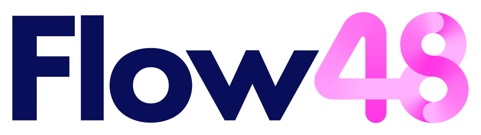
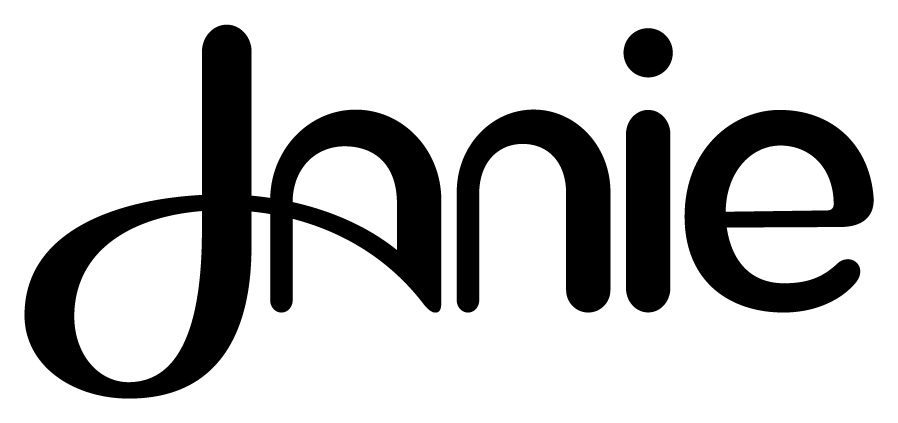
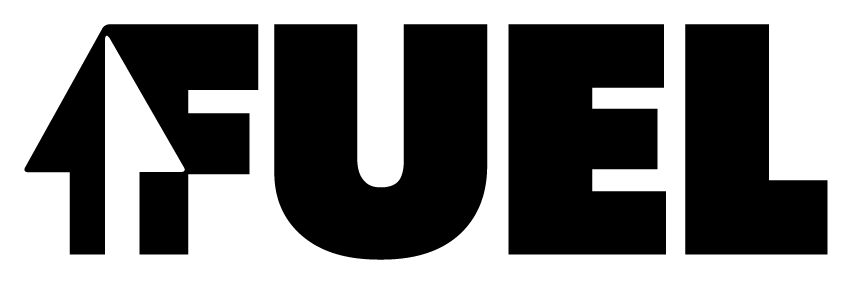
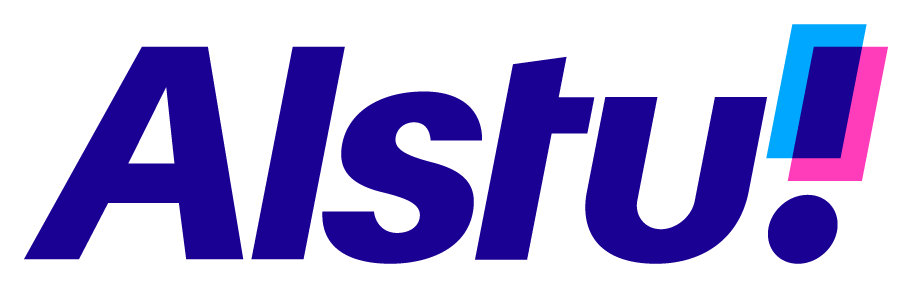

# Mihai Dolganiuc · 现代产品字标参考

本页展示第三方来源作品，不是 Agent 新生成样张。计数：10 个不同名称的字标；包含软件、平台、工程与金融相关项目，Yoodel 行业未知；采用状态未逐项核实。每例保留来源与默认展示入口；来源版本和本库裁切不重复计数。

[风格方法](STYLE.md) · [Prompt](PROMPTS.md) · [完整来源记录](sources.json)

## P01 · BITO

[打开单例](references/P01.png) · [完整预览](references/P01-src-preview.png) · [原采集文件](references/P01-src-original.png) · [来源页面](https://mihai.design/project/wordmarks-collection/)

- 观察：粗重 B 左侧结合上下箭头，ITO 保持宽实块面，形成一个强首字母与稳定整词。
- 迁移：把语义集中在一个字母，其余名称保持清楚的阅读节奏。
- 归属与状态：Mihai Dolganiuc 作者官网作品；行业/概念仅沿用与图像一致的作者图注。采用与现用状态未逐项核实。
- 图像：来源解码后裁切，保持主体像素；未使用 AI 清晰化。

## P02 · Flow48

[打开单例](references/P02.png) · [完整预览](references/P02-src-preview.png) · [原采集文件](references/P02-src-original.png) · [来源页面](https://mihai.design/project/wordmarks-collection/)

- 观察：深色 Flow 与洋红色 48 并列，数字以圆滑笔画交叠，数字成为主要变化点。
- 迁移：对数字有业务意义的名称，比较文字与数字的层级，而非给整词平均加效果。
- 归属与状态：Mihai Dolganiuc 作者官网作品；行业/概念仅沿用与图像一致的作者图注。采用与现用状态未逐项核实。
- 图像：来源解码后裁切，保持主体像素；未使用 AI 清晰化。

## P03 · Yoodel

[打开单例](references/P03.png) · [完整预览](references/P03-src-preview.png) · [原采集文件](references/P03-src-original.png) · [来源页面](https://mihai.design/project/wordmarks-collection/)

- 观察：圆头小写字形高低略有变化，名称两侧的短线呼应发声或呼喊。
- 迁移：以重复端点和节奏表达性格；声音含义是视觉推导，原行业未确认。
- 归属与状态：Mihai Dolganiuc 作者官网作品；行业未知。采用与现用状态未逐项核实。
- 图像：来源解码后裁切，保持主体像素；未使用 AI 清晰化。

## P04 · thundyr

[打开单例](references/P04.png) · [完整预览](references/P04-src-preview.png) · [原采集文件](references/P04-src-original.png) · [来源页面](https://mihai.design/project/wordmarks-collection/)

- 观察：圆头小写字母连续排列，y 的下降笔画折成闪电式尖角。
- 迁移：让一个降部承担产品含义，同时检查是否仍能正确读出 y。
- 归属与状态：Mihai Dolganiuc 作者官网作品；行业/概念仅沿用与图像一致的作者图注。采用与现用状态未逐项核实。
- 图像：来源解码后裁切，保持主体像素；未使用 AI 清晰化。

## P05 · Janie

[打开单例](references/P05.png) · [完整预览](references/P05-src-preview.png) · [原采集文件](references/P05-src-original.png) · [来源页面](https://mihai.design/project/wordmarks-collection/)

- 观察：细长圆头笔画组合名称，J 的大环线穿过 a 的区域，右侧 nie 保持连续阅读。
- 迁移：在局部连笔中加入亲和感，重点验证交叉处的字母分界。
- 归属与状态：Mihai Dolganiuc 作者官网作品；行业/概念仅沿用与图像一致的作者图注。采用与现用状态未逐项核实。
- 图像：来源解码后裁切，保持主体像素；未使用 AI 清晰化。

## P06 · ClipHire

[打开单例](references/P06.png) · [完整预览](references/P06-src-preview.png) · [原采集文件](references/P06-src-original.png) · [来源页面](https://mihai.design/project/wordmarks-collection/)

- 观察：蓝色无衬线字标以大小写区分两段名称，Hire 下方有一条绿色倾斜下划线。
- 迁移：先通过大小写和间距组织复合名称，再加入独立而克制的强调线。
- 归属与状态：Mihai Dolganiuc 作者官网作品；行业/概念仅沿用与图像一致的作者图注。采用与现用状态未逐项核实。
- 图像：来源解码后裁切，保持主体像素；未使用 AI 清晰化。

## P07 · FUEL

[打开单例](references/P07.png) · [完整预览](references/P07-src-preview.png) · [原采集文件](references/P07-src-original.png) · [来源页面](https://mihai.design/project/wordmarks-collection/)

- 观察：粗重全大写字标首端结合向上箭头与白色切口，其余字母为稳定实心形。
- 迁移：用正负形增加含义时先保护 F 的阅读，箭头并非金融或科技品牌的通用要求。
- 归属与状态：Mihai Dolganiuc 作者官网作品；行业/概念仅沿用与图像一致的作者图注。采用与现用状态未逐项核实。
- 图像：来源解码后裁切，保持主体像素；未使用 AI 清晰化。

## P08 · Rplay

[打开单例](references/P08.png) · [完整预览](references/P08-src-preview.png) · [原采集文件](references/P08-src-original.png) · [来源页面](https://mihai.design/project/wordmarks-collection/)

- 观察：R 的内部三角与外侧斜切结合播放意象，play 采用粗重小写结构。
- 迁移：把核心动作融入首字母，避免每个字形重复播放符号。
- 归属与状态：Mihai Dolganiuc 作者官网作品；行业/概念仅沿用与图像一致的作者图注。采用与现用状态未逐项核实。
- 图像：来源解码后裁切，保持主体像素；未使用 AI 清晰化。

## P09 · Alstu!

[打开单例](references/P09.png) · [完整预览](references/P09-src-preview.png) · [原采集文件](references/P09-src-original.png) · [来源页面](https://mihai.design/project/wordmarks-collection/)

- 观察：深蓝斜体名称形成前倾节奏，感叹号由青色与洋红色矩形叠合。
- 迁移：名称保持同一倾向，利用标点承接可控的颜色与层次变化。
- 归属与状态：Mihai Dolganiuc 作者官网作品；行业/概念仅沿用与图像一致的作者图注。采用与现用状态未逐项核实。
- 图像：来源解码后裁切，保持主体像素；未使用 AI 清晰化。

## P10 · DOUBLE

[打开单例](references/P10.png) · [完整预览](references/P10-src-preview.png) · [原采集文件](references/P10-src-original.png) · [来源页面](https://mihai.design/project/wordmarks-collection/)

- 观察：斜体全大写字标配合圆角方孔，D 左侧伸出方向性尖角，内部为播放式空白。
- 迁移：统一笔画倾向与孔洞，再决定一个方向切口是否能增加识别。
- 归属与状态：Mihai Dolganiuc 作者官网作品；行业/概念仅沿用与图像一致的作者图注。采用与现用状态未逐项核实。
- 图像：来源解码后裁切，保持主体像素；未使用 AI 清晰化。

