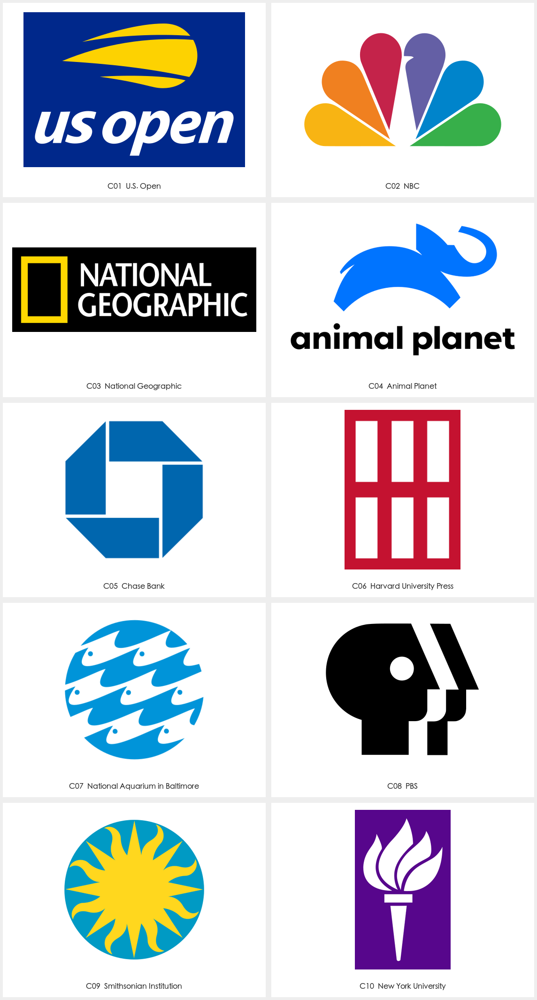
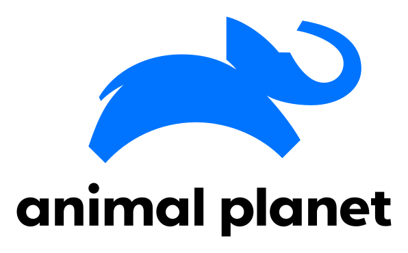
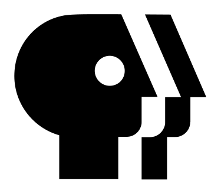

# Chermayeff & Geismar & Haviv（CGH） · 现代主义企业符号参考

本页展示第三方来源作品，不是 Agent 新生成样张。计数：10 个具名品牌项目；当前网站色版不等于首次发布版本。每例保留来源与默认展示入口；来源版本和本库裁切不重复计数。

[风格方法](STYLE.md) · [Prompt](PROMPTS.md) · [完整来源记录](sources.json)

## C01 · U.S. Open

[打开单例](references/C01.png) · [完整预览](references/C01-src-preview.png) · [原采集文件](references/C01-src-original.svg) · [来源页面](https://cghnyc.com/)

- 观察：黄色球形与左向延伸的弧带呈现横向动势，配白色名称与蓝底。
- 迁移：以品牌动作压缩成少量动势线，不借用现有运动赛事轮廓。
- 归属与状态：CGH 工作室作品；具体个人分工未核实。
- 图像：来源解码后裁切，保持主体像素；未使用 AI 清晰化。

## C02 · NBC

[打开单例](references/C02.png) · [完整预览](references/C02-src-preview.png) · [原采集文件](references/C02-src-original.svg) · [来源页面](https://cghnyc.com/)

- 观察：多色扇形由圆头单元展开，中央留白参与鸟形识别。
- 迁移：重复单元需共同形成主体，先检查整体剪影而非先定颜色。
- 归属与状态：CGH 工作室作品；具体个人分工未核实。
- 图像：来源解码后裁切，保持主体像素；未使用 AI 清晰化。

## C03 · National Geographic

[打开单例](references/C03.png) · [完整预览](references/C03-src-preview.png) · [原采集文件](references/C03-src-original.svg) · [来源页面](https://cghnyc.com/)

- 观察：黄色矩形框与右侧两行白字在黑底上形成克制组合。
- 迁移：最简单几何也需明确比例与语义，检验图文搭配而非添加装饰。
- 归属与状态：CGH 工作室作品；具体个人分工未核实。
- 图像：来源解码后裁切，保持主体像素；未使用 AI 清晰化。

## C04 · Animal Planet

[打开单例](references/C04.png) · [完整预览](references/C04-src-preview.png) · [原采集文件](references/C04-src-original.svg) · [来源页面](https://cghnyc.com/)

- 观察：蓝色侧身象的抬头、卷鼻和上扬背线形成轻快轮廓。
- 迁移：用姿态差异表达品牌气质；不能把通用动物轮廓视为足够独特。
- 归属与状态：CGH 工作室作品；具体个人分工未核实。
- 图像：来源解码后裁切，保持主体像素；未使用 AI 清晰化。

## C05 · Chase Bank

[打开单例](references/C05.png) · [完整预览](references/C05-src-preview.png) · [原采集文件](references/C05-src-original.svg) · [来源页面](https://cghnyc.com/)

- 观察：四个蓝色折面围绕方形留白，外缘形成紧凑多边形。
- 迁移：用模块的方向与中间空间建立整体，保持组装逻辑清楚。
- 归属与状态：CGH 工作室作品；具体个人分工未核实。
- 图像：来源解码后裁切，保持主体像素；未使用 AI 清晰化。

## C06 · Harvard University Press

[打开单例](references/C06.png) · [完整预览](references/C06-src-preview.png) · [原采集文件](references/C06-src-original.svg) · [来源页面](https://cghnyc.com/)

- 观察：六个白色竖块在红底分成两行，中部横向留白清楚。
- 迁移：用最少模块组织字母或机构概念，控制间隙和整体宽高。
- 归属与状态：CGH 工作室作品；具体个人分工未核实。
- 图像：来源解码后裁切，保持主体像素；未使用 AI 清晰化。

## C07 · National Aquarium in Baltimore

[打开单例](references/C07.png) · [完整预览](references/C07-src-preview.png) · [原采集文件](references/C07-src-original.svg) · [来源页面](https://cghnyc.com/)

- 观察：蓝色圆形内重复的鱼和波浪般留白形成连续节奏。
- 迁移：让重复与裁切共同表达群体或环境，检查边缘残缺是否有秩序。
- 归属与状态：CGH 工作室作品；具体个人分工未核实。
- 图像：来源解码后裁切，保持主体像素；未使用 AI 清晰化。

## C08 · PBS

[打开单例](references/C08.png) · [完整预览](references/C08-src-preview.png) · [原采集文件](references/C08-src-original.svg) · [来源页面](https://cghnyc.com/)

- 观察：黑色重叠侧脸与白色字母般切口构成紧凑人形识别。
- 迁移：多重读法应共用同一结构，避免把两个图标机械叠加。
- 归属与状态：CGH 工作室作品；具体个人分工未核实。
- 图像：来源解码后裁切，保持主体像素；未使用 AI 清晰化。

## C09 · Smithsonian Institution

[打开单例](references/C09.png) · [完整预览](references/C09-src-preview.png) · [原采集文件](references/C09-src-original.svg) · [来源页面](https://cghnyc.com/)

- 观察：黄色多尖太阳置于蓝色圆中，直尖和曲尖交替。
- 迁移：用轮廓节奏表达能量，选择适合品牌的单元与重复方式。
- 归属与状态：CGH 工作室作品；具体个人分工未核实。
- 图像：来源解码后裁切，保持主体像素；未使用 AI 清晰化。

## C10 · New York University

[打开单例](references/C10.png) · [完整预览](references/C10-src-preview.png) · [原采集文件](references/C10-src-original.svg) · [来源页面](https://cghnyc.com/)

- 观察：白色火炬以简化焰形和短横结构置于紫色方块。
- 迁移：将对象压缩为必要部件，明确容器与图形是否需要同时存在。
- 归属与状态：CGH 工作室作品；具体个人分工未核实。
- 图像：来源解码后裁切，保持主体像素；未使用 AI 清晰化。

