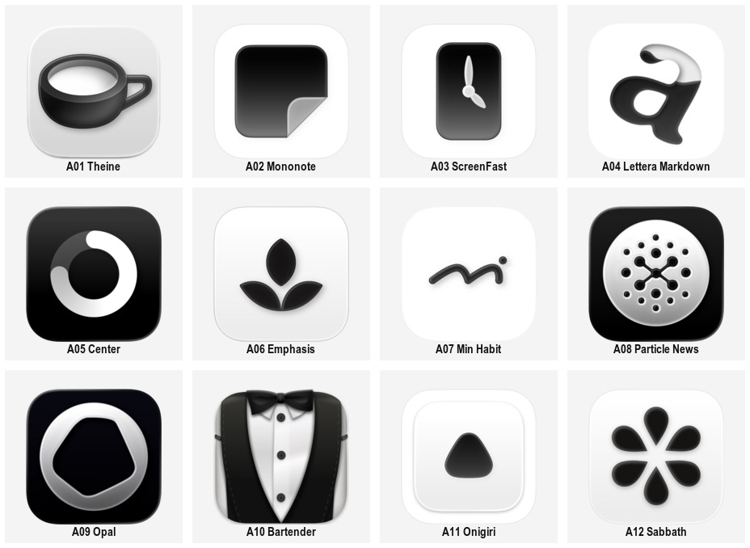
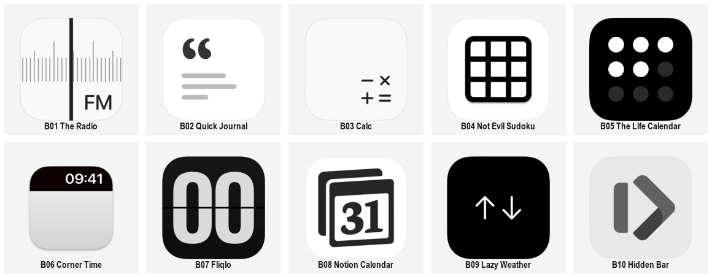
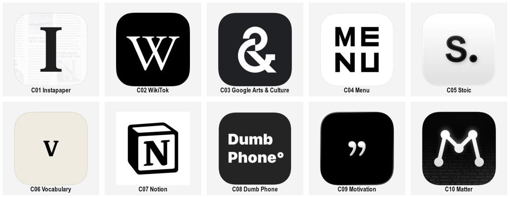
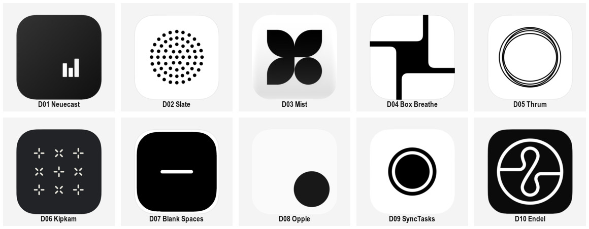

# 黑白产品意象 · 42 个参考案例

本页用于按方法挑选参考。先读 [STYLE.md](STYLE.md)，再选与新品牌匹配的条目；优先遵循用户任务与上层规则。每个产品仅在一个主组计数，材质与构思可以交叉标注。全部为第三方产品标志，原图来自实际查看的 [Digital Minimalist 产品目录](https://www.digitalminimalist.com/tools)；产品链接由该目录提供。部分另有 X 历史帖核对，详见 [sources.json](sources.json)。

每张总览保留原色，只做等比缩略与排列；编号对应表格。点击产品名查看网站条目，点击原图查看本地 PNG。观察列描述可见形态，迁移列是研究建议，不能当作原作者意图。字体家族、矢量母版与分发许可未核验；这些图不能作为新品牌资产交付。

42 个产品参考已按当前展示与研究用途检查清晰度并保留，未经过 AI 清晰化。读取细节时打开下表的单图预览，不从缩略总览反推微纹理或字体参数。

## A · 灰阶立体单体 · 12 例

用灰阶、高光和阴影塑造一个完整主体；器物、字形和抽象符号均可采用。材质是表现维度，不能替代构思。

| 编号 / 产品 | 可见特征 | 可迁移方法 | 原图预览 |
| --- | --- | --- | --- |
| A01 · [Theine](https://www.digitalminimalist.com/tools/theine) | 厚壁杯口、右侧杯把与柔和阴影建立器物体积。 | 从产品动作寻找器物；先做可辨轮廓，再决定表面。 | [预览](references/catalog-theine.png) |
| A02 · [Mononote](https://www.digitalminimalist.com/tools/mononote) | 黑色便签主体右下卷起一角，亮面集中于折角。 | 用一个局部转折说明材质，避免全画布同时发亮。 | [预览](references/catalog-mononote.png) |
| A03 · [ScreenFast](https://www.digitalminimalist.com/tools/screenfast) | 黑色立体底块上放少量浅色指针，灰阶与明暗把指针托出。 | 用简单功能符号承载立体底板，分别控制主体与载体。 | [预览](references/catalog-screenfast.png) |
| A04 · [Lettera Markdown](https://www.digitalminimalist.com/tools/lettera-markdown) | 小写 a 扭转成圆润带状实体，黑白表面相互翻转。 | 在保持字母辨识的前提下试验带面翻转。 | [预览](references/catalog-lettera-markdown.png) |
| A05 · [Center](https://www.digitalminimalist.com/tools/center) | 黑底上是明暗分段圆环，亮段端部圆润，环内外对比强。 | 用圆环的明暗分段与厚度组织体积；不要只套同一高光。 | [预览](references/catalog-center.png) |
| A06 · [Emphasis](https://www.digitalminimalist.com/tools/emphasis) | 三片黑色叶形聚合，边缘高光与阴影轻微。 | 将自然形压缩到几片关键轮廓，再建立柔和体积。 | [预览](references/catalog-emphasis.png) |
| A07 · [Min Habit](https://www.digitalminimalist.com/tools/min-habit) | 一条圆润黑色弯线配小圆点，边缘与接触阴影使其像实体线材。 | 让线条成为有厚度的材料，同时保留识别转折。 | [预览](references/catalog-min-habit.png) |
| A08 · [Particle News](https://www.digitalminimalist.com/tools/particle-news) | 浅色圆盘包含孔洞和中心连接结构，黑底加强深浅关系。 | 用凹孔、连接与实体边缘表现结构，不依赖复杂场景。 | [预览](references/catalog-particle-news.png) |
| A09 · [Opal](https://www.digitalminimalist.com/tools/opal) | 银灰色闭合环包围不规则孔洞，宽窄变化与渐变形成雕塑感。 | 把负空间作为主体之一，比较内外轮廓的张力。 | [预览](references/catalog-opal.png) |
| A10 · [Bartender](https://www.digitalminimalist.com/tools/bartender) | 黑白礼服、领结与纽扣组成拟物主体，左右材质高光清楚。 | 用职业或角色的代表性衣物建立语义；小尺寸需单独简化。 | [预览](references/catalog-bartender.png) |
| A11 · [Onigiri](https://www.digitalminimalist.com/tools/onigiri) | 浅底中央放一个小型深色圆角三角实体，边缘柔亮。 | 对比单体的画布占比与圆角，不用增加配件来补识别。 | [预览](references/catalog-onigiri.png) |
| A12 · [Sabbath](https://www.digitalminimalist.com/tools/sabbath) | 六片深色圆头花瓣围出星形负空间，边缘有细微立体感。 | 同时设计花瓣实体与中心空隙，材质服从放射结构。 | [预览](references/catalog-sabbath.png) |

## B · 功能与界面隐喻 · 10 例

把产品的操作、读数、信息结构或状态差异浓缩成标志。优先保留具有意义的层级，不要求所有样本都是仪表。

| 编号 / 产品 | 可见特征 | 可迁移方法 | 原图预览 |
| --- | --- | --- | --- |
| B01 · [The Radio](https://www.digitalminimalist.com/tools/the-radio) | 灰色刻度横向排列，粗黑竖向指针穿越画布，FM 位于右下。 | 用一个强焦点统领弱刻度，测试细节缩小时的合并。 | [预览](references/catalog-the-radio.png) |
| B02 · [Quick Journal](https://www.digitalminimalist.com/tools/quick-journal) | 深色引号在左上，三条浅灰短横线模拟文字段落。 | 从内容类型提取一个标点与少量段落结构。 | [预览](references/catalog-quick-journal.png) |
| B03 · [Calc](https://www.digitalminimalist.com/tools/calc) | 加减乘除四个符号聚于右下，其余画布留白。 | 让功能符号的关系与位置参与识别，验证偏置小主体。 | [预览](references/catalog-calc.png) |
| B04 · [Not Evil Sudoku](https://www.digitalminimalist.com/tools/not-evil-sudoku) | 黑色圆角方框和粗直线构成规则宫格。 | 把任务的空间结构压缩为可读网格，检查孔隙。 | [预览](references/catalog-not-evil-sudoku.png) |
| B05 · [The Life Calendar](https://www.digitalminimalist.com/tools/the-life-calendar) | 九个圆点构成三行，白点与暗点表示不同状态。 | 用相同元素的状态差表达进度，避免依赖文字解释。 | [预览](references/catalog-the-life-calendar.png) |
| B06 · [Corner Time](https://www.digitalminimalist.com/tools/corner-time) | 顶部深色横条写时间，下面大面积浅灰，模拟屏幕顶部区域。 | 从功能发生的位置取构图，区分数字内容和固定几何。 | [预览](references/catalog-corner-time.png) |
| B07 · [Fliqlo](https://www.digitalminimalist.com/tools/fliqlo) | 黑底双零数字跨越横向分割线，翻页时钟的结构明确。 | 将显示机制与数字结合；更换数字不等于新品牌构思。 | [预览](references/catalog-fliqlo.png) |
| B08 · [Notion Calendar](https://www.digitalminimalist.com/tools/notion-calendar) | 前后错位的日历页包住衬线数字 31，黑白轮廓清楚。 | 用叠页与日期建立工具联想，记录家族品牌共用语言。 | [预览](references/catalog-notion-calendar.png) |
| B09 · [Lazy Weather](https://www.digitalminimalist.com/tools/lazy-weather) | 黑底中上下两根白色箭头并列，线条细且结构相同。 | 用成对方向表达比较关系，检查普通符号的独特性。 | [预览](references/catalog-lazy-weather.png) |
| B10 · [Hidden Bar](https://www.digitalminimalist.com/tools/hidden-bar) | 浅灰底上是竖条与向右折角，折角内部以深浅区分转折。 | 从隐藏、展开与边界关系提取标志，再检查交叠层级。 | [预览](references/catalog-hidden-bar.png) |

## C · 字母与排版 · 10 例

用首字母、定制字形、标点或短词构成主识别。分别选择衬线、无衬线、几何化字形与标点路线；精确字体未知时只记录形态。

| 编号 / 产品 | 可见特征 | 可迁移方法 | 原图预览 |
| --- | --- | --- | --- |
| C01 · [Instapaper](https://www.digitalminimalist.com/tools/instapaper) | 粗大衬线 I 位于中心，极浅文字版面退后。 | 字母为主、内容纹理为辅；新品牌应重新设计字形比例。 | [预览](references/catalog-instapaper.png) |
| C02 · [WikiTok](https://www.digitalminimalist.com/tools/wikitok) | 大写白色衬线 W 置于纯黑底，居中且占比较大。 | 用字面的宽度、衬线和留白组织气质，不靠纹理。 | [预览](references/catalog-wikitok.png) |
| C03 · [Google Arts & Culture](https://www.digitalminimalist.com/tools/google-arts-culture) | 白色 & 用粗圆环与斜向笔画构成，黑底强对比。 | 探索标点自身的连续路径与交叉方式。 | [预览](references/catalog-google-arts-culture.png) |
| C04 · [Menu](https://www.digitalminimalist.com/tools/menu) | MENU 分成 ME 与 NU 两行，粗无衬线字面形成方块。 | 通过断行和字面密度建立短词标志，保持阅读顺序。 | [预览](references/catalog-menu.png) |
| C05 · [Stoic](https://www.digitalminimalist.com/tools/stoic) | 小写 s 与句点组成单体，表面有轻微灰阶体积。 | 让一个标点成为节奏点；材质与字形分别决策。 | [预览](references/catalog-stoic.png) |
| C06 · [Vocabulary](https://www.digitalminimalist.com/tools/vocabulary) | 浅暖底中央放一枚黑色衬线 v，周围留白宽。 | 研究单字母的安静尺度；暖底与中性灰底分别比较。 | [预览](references/catalog-vocabulary.png) |
| C07 · [Notion](https://www.digitalminimalist.com/tools/notion) | 衬线 N 嵌入有透视感的黑白盒状外框。 | 让字母与载体形成独有结合，不直接借用原盒形。 | [预览](references/catalog-notion.png) |
| C08 · [Dumb Phone](https://www.digitalminimalist.com/tools/dumb-phone) | Dumb Phone 两行粗白字排列在深色底上，附小型圆形细节。 | 以词语为主体时处理行长和节奏，小尺寸另做识别检查。 | [预览](references/catalog-dumb-phone.png) |
| C09 · [Motivation](https://www.digitalminimalist.com/tools/motivation) | 黑底中央是一对白色弯引号，带柔和表面明暗。 | 内容语义可由标点承载，同时防止与通用引用符号混同。 | [预览](references/catalog-motivation.png) |
| C10 · [Matter](https://www.digitalminimalist.com/tools/matter) | 发亮的节点和连线构成 M，背景存在很弱的文字。 | 把字母骨架与连接关系结合；辨识应先于背景内容。 | [预览](references/catalog-matter.png) |

## D · 抽象几何 · 10 例

用点、线、面、重复或负空间建立识别；可以具备产品联想，但未获得作者说明时不能将联想写成品牌事实。

| 编号 / 产品 | 可见特征 | 可迁移方法 | 原图预览 |
| --- | --- | --- | --- |
| D01 · [Neuecast](https://www.digitalminimalist.com/tools/neuecast) | 黑色画布右下放三根共底白柱，高度错落且主体很小。 | 通过占比与偏置制造安静感，同时验证目标尺寸。 | [预览](references/catalog-neuecast.png) |
| D02 · [Slate](https://www.digitalminimalist.com/tools/slate) | 黑色圆点以错列方式聚成近圆形团簇，外围稀疏收拢。 | 比较规则点阵与有机边界的关系，保留整体轮廓。 | [预览](references/catalog-slate.png) |
| D03 · [Mist](https://www.digitalminimalist.com/tools/mist) | 三个带尖角的圆润瓣形与一个圆形组合成四象限。 | 在共同曲率中设置一个不同元素，建立可记忆差异。 | [预览](references/catalog-mist.png) |
| D04 · [Box Breathe](https://www.digitalminimalist.com/tools/box-breathe) | 黑色弯角从四边向内汇合，中央形成交错的方形关系。 | 同时控制边缘延伸与中心负空间，避免只看单根线。 | [预览](references/catalog-box-breathe.png) |
| D05 · [Thrum](https://www.digitalminimalist.com/tools/thrum) | 数条略不规则的细圆环互相错位。 | 用重复与轻微偏差形成节奏，避免自动磨成完美同心圆。 | [预览](references/catalog-thrum.png) |
| D06 · [Kipkam](https://www.digitalminimalist.com/tools/kipkam) | 九个浅色小十字与斜十字交替成方阵，深色底。 | 用方向变化建立整体纹样，先测试缩小后的图团。 | [预览](references/catalog-kipkam.png) |
| D07 · [Blank Spaces](https://www.digitalminimalist.com/tools/blank-spaces) | 深色底上只有一根短白横线，位于中央略偏下。 | 把留白与位置当作构图变量；极少元素仍需独特性检查。 | [预览](references/catalog-blank-spaces.png) |
| D08 · [Oppie](https://www.digitalminimalist.com/tools/oppie) | 浅色画布右下是一枚黑色圆点。 | 研究元素少到极限时，位置与尺度能承担多少识别。 | [预览](references/catalog-oppie.png) |
| D09 · [SyncTasks](https://www.digitalminimalist.com/tools/synctasks) | 黑色圆盘配白色环隙及外侧黑环，整体居中。 | 通过环隙宽度与图底反转建立关系，检查小尺寸粘连。 | [预览](references/catalog-synctasks.png) |
| D10 · [Endel](https://www.digitalminimalist.com/tools/endel) | 白色外圆内包含连续弯曲线与横向分隔，形成闭合负空间。 | 先设计曲线与内部分区的拓扑，再调整圆角和线宽。 | [预览](references/catalog-endel.png) |

## 选样与验收

先根据构思选择 B / C / D，若需要实体触感再比较 A 的表现方法；A 也可以从器物构思独立进入。每个组是参考方向，不是互斥分类。以当前 42 个产品计数，原图、预览、总览、同一产品的文章版本均不能再计一次。

选中参考后，明确借用的是构思方法、形状关系、材质还是构图。禁止以换品牌名、换字母或微调比例代替独立设计。新品牌生成后检查轮廓独立性、文字准确性、目标尺寸与图底对比；实际输出通过前，整个包保持 `provisional`。
