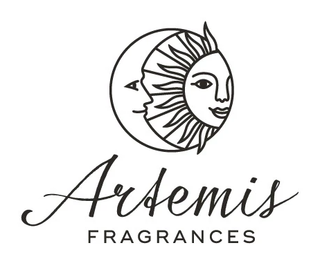
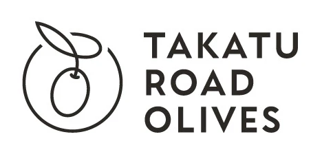
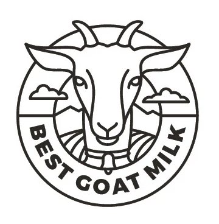
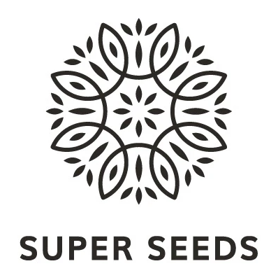

# 单线与轮廓图形 · 十例参考

十例分别按具名标志去重；源图、预览和裁切图不重复计数。作者说明这是为不同客户制作的合集；这里按可读品牌字样辨认十个标志，不以合集图片数推断客户合同数。本轮保留清晰来源，未使用 AI 清晰化。总览用于比较，逐例 PNG 与完整源文件用于看细节。

## L01 · Hearty Heritage

圆框中用简化动物侧面与心形轮廓共用边界，下方搭配连笔主词及大写副词。

可迁移方法：先规划动物与附属符号的共用线，再处理字标层级。

[清晰单例](references/L01.png) · [完整源文件](references/L01-original.webp) · [来源页面](https://www.behance.net/gallery/96077953/Monoline-Logos)

作者：Mila Katagarova；来源为本人作品合集。展示尺寸 508×364，来源文件 1401×701，裁切不放大。

## L02 · Nuteese

圆形人脸由五官线、竖向线和右下叶片组织，圆框限定整体形状。

可迁移方法：通过少数必要线条区分五官与主题元素，避免增加写实阴影。

[清晰单例](references/L02.png) · [完整源文件](references/L02-original.webp) · [来源页面](https://www.behance.net/gallery/96077953/Monoline-Logos)

作者：Mila Katagarova；来源为本人作品合集。展示尺寸 468×324，来源文件 1401×701，裁切不放大。

## L03 · Karma

四片有内部分割线的叶状单元围绕中心排列，线框与横向字标并置。

可迁移方法：用重复单元和内线形成节奏，检查中心交汇处不过密。

[清晰单例](references/L03.png) · [完整源文件](references/L03-original.webp) · [来源页面](https://www.behance.net/gallery/96077953/Monoline-Logos)

作者：Mila Katagarova；来源为本人作品合集。展示尺寸 508×148，来源文件 1401×701，裁切不放大。

## L04 · Native Joy Superfoods

植物线条从中心向上生长，外侧弧线局部断开，下部曲线分区形成基底。

可迁移方法：让外框开口与对象方向配合，不强制所有图形封口。

[清晰单例](references/L04.png) · [完整源文件](references/L04-original.webp) · [来源页面](https://www.behance.net/gallery/96077953/Monoline-Logos)

作者：Mila Katagarova；来源为本人作品合集。展示尺寸 508×184，来源文件 1401×701，裁切不放大。

## L05 · Artemis Fragrances

太阳与月亮侧面在圆形内相对，放射线与五官构成较高细节密度。

可迁移方法：以主体关系确定重点；缩小时先简化放射线等次要内容。

[清晰单例](references/L05.png) · [完整源文件](references/L05-original.webp) · [来源页面](https://www.behance.net/gallery/96077953/Monoline-Logos)

作者：Mila Katagarova；来源为本人作品合集。展示尺寸 462×378，来源文件 1401×701，裁切不放大。

## L06 · Takatu Road Olives

橄榄果与叶片由流动线条连接，外部圆弧在上方留口。

可迁移方法：用连接关系表达植物结构，不依赖颜色区分叶与果。

[清晰单例](references/L06.png) · [完整源文件](references/L06-original.webp) · [来源页面](https://www.behance.net/gallery/96077953/Monoline-Logos)

作者：Mila Katagarova；来源为本人作品合集。展示尺寸 468×221，来源文件 1401×701，裁切不放大。

## L07 · Best Goat Milk

正面山羊伸出圆框上部，内部有云与山线，下部环排文字形成基底。

可迁移方法：将主体越框作为层次手段，控制文字圈和背景线的距离。

[清晰单例](references/L07.png) · [完整源文件](references/L07-original.webp) · [来源页面](https://www.behance.net/gallery/96077953/Monoline-Logos)

作者：Mila Katagarova；来源为本人作品合集。展示尺寸 360×368，来源文件 1401×701，裁切不放大。

## L08 · Shire City Herbals

手托幼苗置于圆框，植物线与手部线在中心相接，下方弧形文字呼应圆形。

可迁移方法：先保证手与植物分别可认，再简化连接处的线条。

[清晰单例](references/L08.png) · [完整源文件](references/L08-original.webp) · [来源页面](https://www.behance.net/gallery/96077953/Monoline-Logos)

作者：Mila Katagarova；来源为本人作品合集。展示尺寸 348×357，来源文件 1401×701，裁切不放大。

## L09 · Super Seeds

叶状线框围绕中心旋转，实心种子形细节填充间隙，形成放射花形。

可迁移方法：用重复和少量实心强调形成节奏；它不是全图严格等粗的纯线稿。

[清晰单例](references/L09.png) · [完整源文件](references/L09-original.webp) · [来源页面](https://www.behance.net/gallery/96077953/Monoline-Logos)

作者：Mila Katagarova；来源为本人作品合集。展示尺寸 398×400，来源文件 1401×701，裁切不放大。

## L10 · Damascene Essential Oils

花瓣般环绕线条包围中央水滴形，外侧环排文字，下方另设横向名称。

可迁移方法：把中心闭合形与环绕路径区分，再处理环排与横排信息层级。

[清晰单例](references/L10.png) · [完整源文件](references/L10-original.webp) · [来源页面](https://www.behance.net/gallery/96077953/Monoline-Logos)

作者：Mila Katagarova；来源为本人作品合集。展示尺寸 508×372，来源文件 1401×701，裁切不放大。

## 使用边界

上述为可见特征的整理与评论。原字体、作者未说明的语义和具体委托/采用状态不补编；来源页的年份按其标签记录。生成迁移尚未验证。字段、文件校验与清晰度判断见 [sources.json](sources.json)，使用方法见 [STYLE.md](STYLE.md)。
