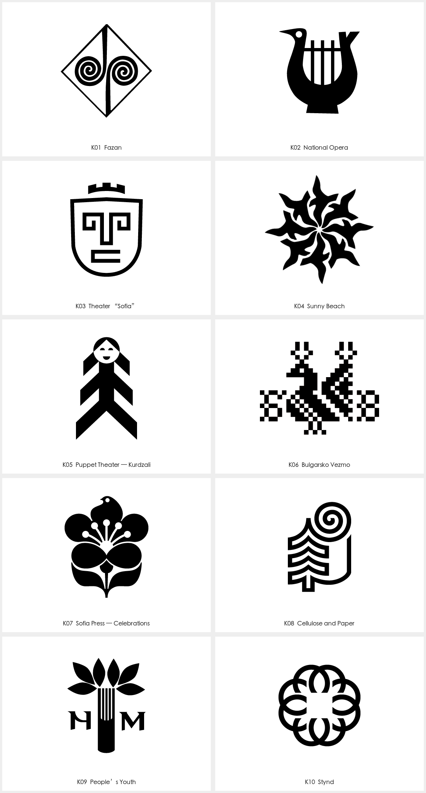
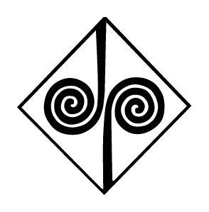
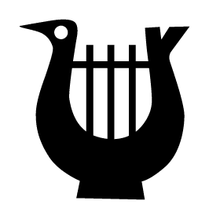
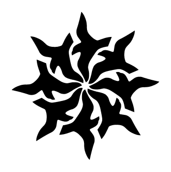
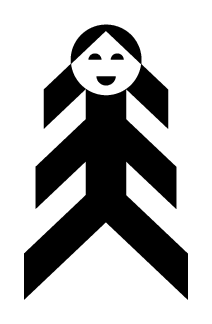
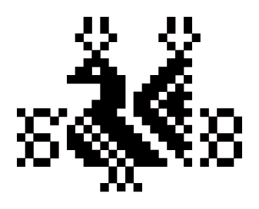
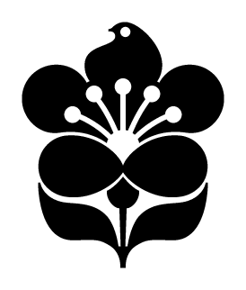
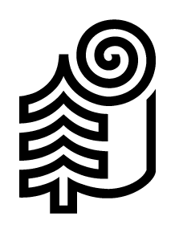
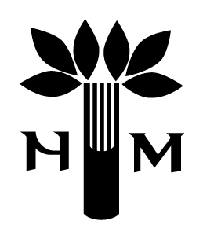
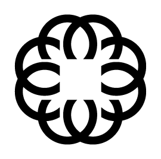

# Stefan Kanchev · 装饰与民艺符号参考

本页展示第三方来源作品，不是 Agent 新生成样张。计数：10 个档案标志条目；同一条目的相关版本不重复计数。每例保留来源与默认展示入口；来源版本和本库裁切不重复计数。

[风格方法](STYLE.md) · [Prompt](PROMPTS.md) · [完整来源记录](sources.json)

## K01 · Fazan

[打开单例](references/K01.png) · [完整预览](references/K01-src-preview.png) · [原采集文件](references/K01-src-original.gif) · [来源页面](https://stefankanchev.com/en/)

- 观察：双螺旋位于菱形内部，中央竖形连接上下尖角。
- 迁移：用一个边界把卷曲单元组织起来，检查内外线条关系。
- 归属与状态：Stefan Kanchev；项目名沿用 Stefan Kanchev Project 档案，年代未逐项核实。
- 图像：来源解码后裁切，保持主体像素；未使用 AI 清晰化。

## K02 · National Opera

[打开单例](references/K02.png) · [完整预览](references/K02-src-preview.png) · [原采集文件](references/K02-src-original.gif) · [来源页面](https://stefankanchev.com/en/)

- 观察：鸟的头颈与琴形主体融合，竖线像琴弦分割内部。
- 迁移：让文化意象共用外轮廓，而不是将鸟图与乐器并排摆放。
- 归属与状态：Stefan Kanchev；项目名沿用 Stefan Kanchev Project 档案，年代未逐项核实。
- 图像：来源解码后裁切，保持主体像素；未使用 AI 清晰化。

## K03 · Theater “Sofia”

[打开单例](references/K03.png) · [完整预览](references/K03-src-preview.png) · [原采集文件](references/K03-src-original.gif) · [来源页面](https://stefankanchev.com/en/)

- 观察：城垛状顶部、盾形外轮廓与方折面孔构成剧场图形。
- 迁移：把建筑与面孔的共同边界作为构思核心。
- 归属与状态：Stefan Kanchev；项目名沿用 Stefan Kanchev Project 档案，年代未逐项核实。
- 图像：来源解码后裁切，保持主体像素；未使用 AI 清晰化。

## K04 · Sunny Beach

[打开单例](references/K04.png) · [完整预览](references/K04-src-preview.png) · [原采集文件](references/K04-src-original.gif) · [来源页面](https://stefankanchev.com/en/)

- 观察：尖曲单元围绕中心旋转，形成花与太阳之间的动态轮廓。
- 迁移：以单元方向和间距控制旋转感，避免中心过密。
- 归属与状态：Stefan Kanchev；项目名沿用 Stefan Kanchev Project 档案，年代未逐项核实。
- 图像：来源解码后裁切，保持主体像素；未使用 AI 清晰化。

## K05 · Puppet Theater — Kurdzali

[打开单例](references/K05.png) · [完整预览](references/K05-src-preview.png) · [原采集文件](references/K05-src-original.gif) · [来源页面](https://stefankanchev.com/en/)

- 观察：笑脸、头部和层叠斜块构成木偶般的竖向人物。
- 迁移：用重复斜块表达服装或动作，保留清楚的面部空间。
- 归属与状态：Stefan Kanchev；项目名沿用 Stefan Kanchev Project 档案，年代未逐项核实。
- 图像：来源解码后裁切，保持主体像素；未使用 AI 清晰化。

## K06 · Bulgarsko Vezmo

[打开单例](references/K06.png) · [完整预览](references/K06-src-preview.png) · [原采集文件](references/K06-src-original.gif) · [来源页面](https://stefankanchev.com/en/)

- 观察：双鸟与两侧花形由黑白方块组织，呈现刺绣式节奏。
- 迁移：先建立方格单元与对称关系，再做适合品牌的新图案。
- 归属与状态：Stefan Kanchev；项目名沿用 Stefan Kanchev Project 档案，年代未逐项核实。
- 图像：来源解码后裁切，保持主体像素；未使用 AI 清晰化。

## K07 · Sofia Press — Celebrations

[打开单例](references/K07.png) · [完整预览](references/K07-src-preview.png) · [原采集文件](references/K07-src-original.gif) · [来源页面](https://stefankanchev.com/en/)

- 观察：鸟形位于花的上部，圆点花蕊、叶形和弧线形成完整团块。
- 迁移：使鸟与植物结构融合，避免单纯给花顶端添一只鸟。
- 归属与状态：Stefan Kanchev；项目名沿用 Stefan Kanchev Project 档案，年代未逐项核实。
- 图像：来源解码后裁切，保持主体像素；未使用 AI 清晰化。

## K08 · Cellulose and Paper

[打开单例](references/K08.png) · [完整预览](references/K08-src-preview.png) · [原采集文件](references/K08-src-original.gif) · [来源页面](https://stefankanchev.com/en/)

- 观察：卷纸般螺旋连接树形层叠线和外侧直边。
- 迁移：用卷曲端与重复层级连接两个对象，不依赖复杂纹理。
- 归属与状态：Stefan Kanchev；项目名沿用 Stefan Kanchev Project 档案，年代未逐项核实。
- 图像：来源解码后裁切，保持主体像素；未使用 AI 清晰化。

## K09 · People’s Youth

[打开单例](references/K09.png) · [完整预览](references/K09-src-preview.png) · [原采集文件](references/K09-src-original.gif) · [来源页面](https://stefankanchev.com/en/)

- 观察：多片尖叶围绕竖向茎束展开，左右有辅助字形。
- 迁移：让主体与名称可拆开应用，保留叶片之间的间隙。
- 归属与状态：Stefan Kanchev；项目名沿用 Stefan Kanchev Project 档案，年代未逐项核实。
- 图像：来源解码后裁切，保持主体像素；未使用 AI 清晰化。

## K10 · Stynd

[打开单例](references/K10.png) · [完整预览](references/K10-src-preview.png) · [原采集文件](references/K10-src-original.gif) · [来源页面](https://stefankanchev.com/en/)

- 观察：多段相交弧线围绕中央方形留白组成花状结。
- 迁移：先检验交汇处的图底关系，再调整重复数量。
- 归属与状态：Stefan Kanchev；项目名沿用 Stefan Kanchev Project 档案，年代未逐项核实。
- 图像：来源解码后裁切，保持主体像素；未使用 AI 清晰化。

