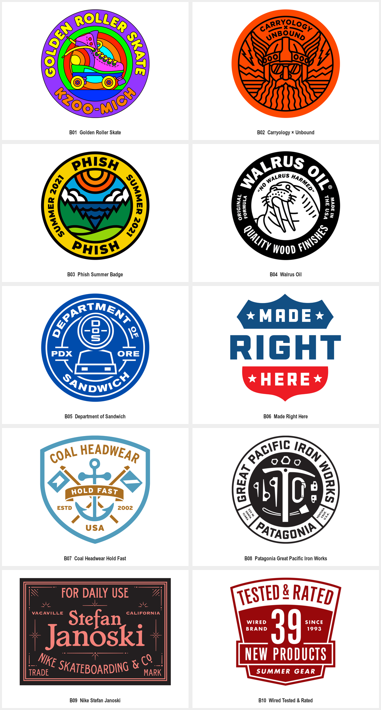
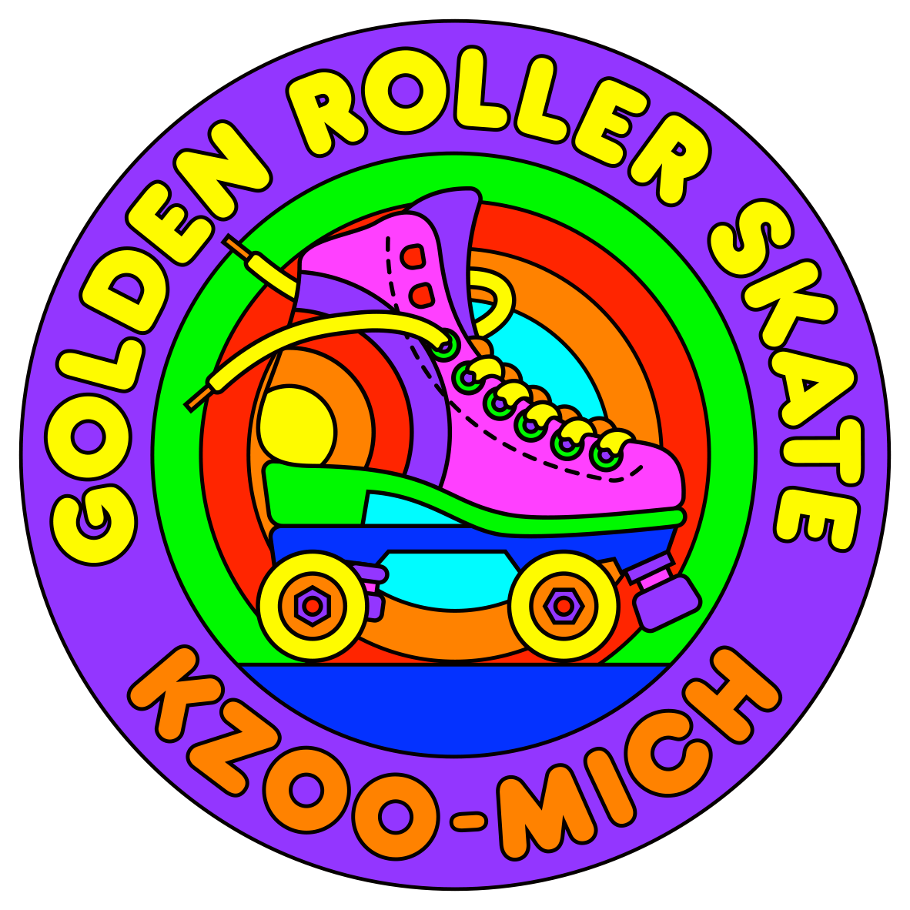
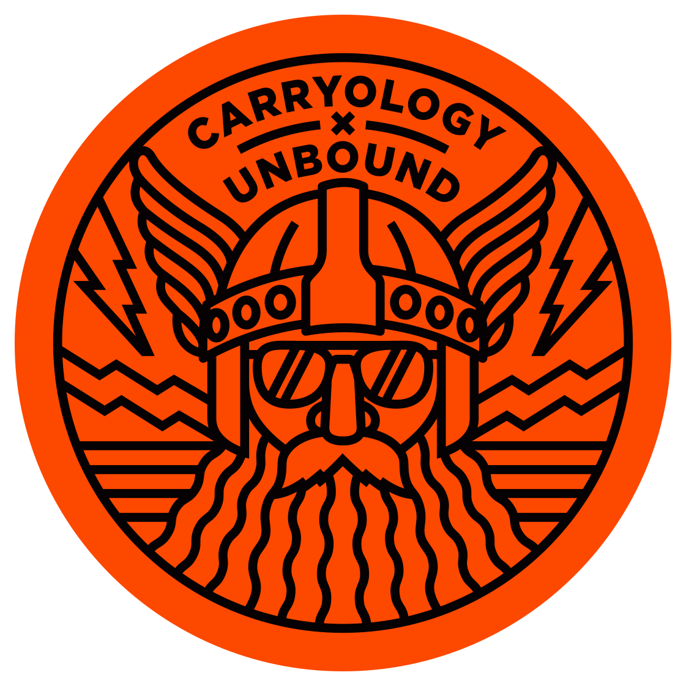
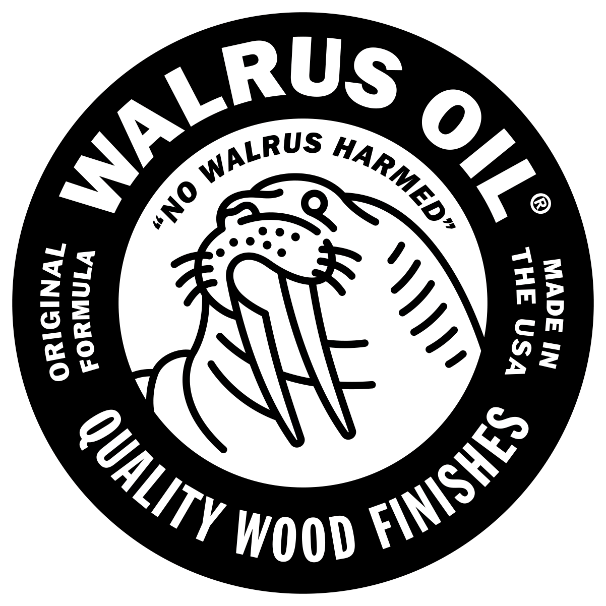
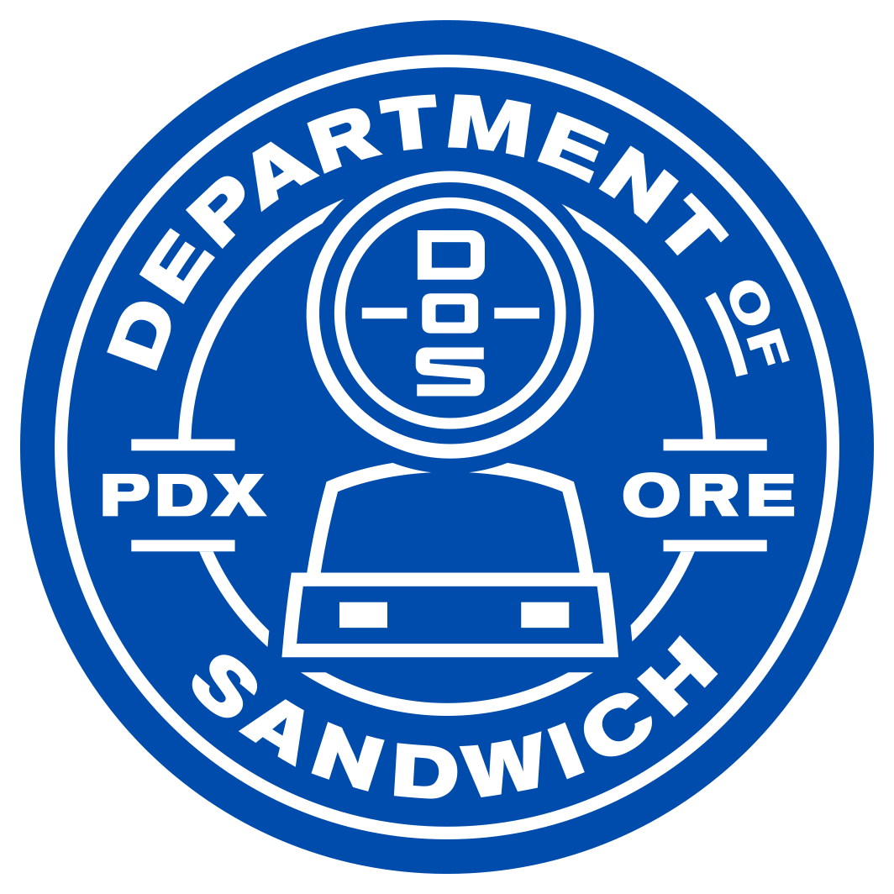
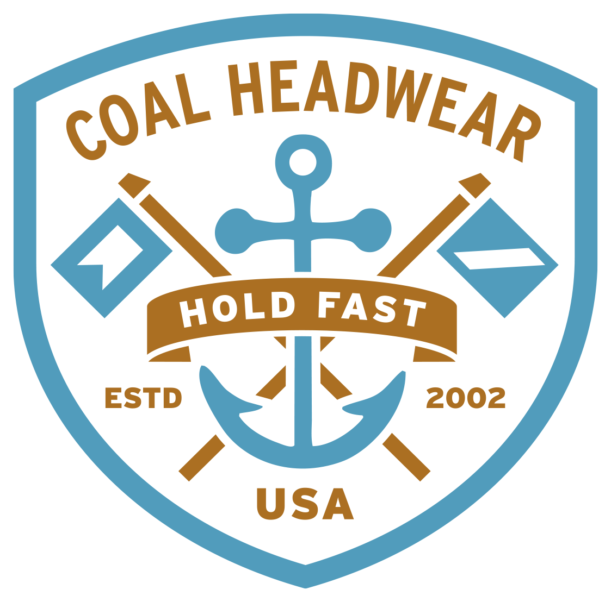
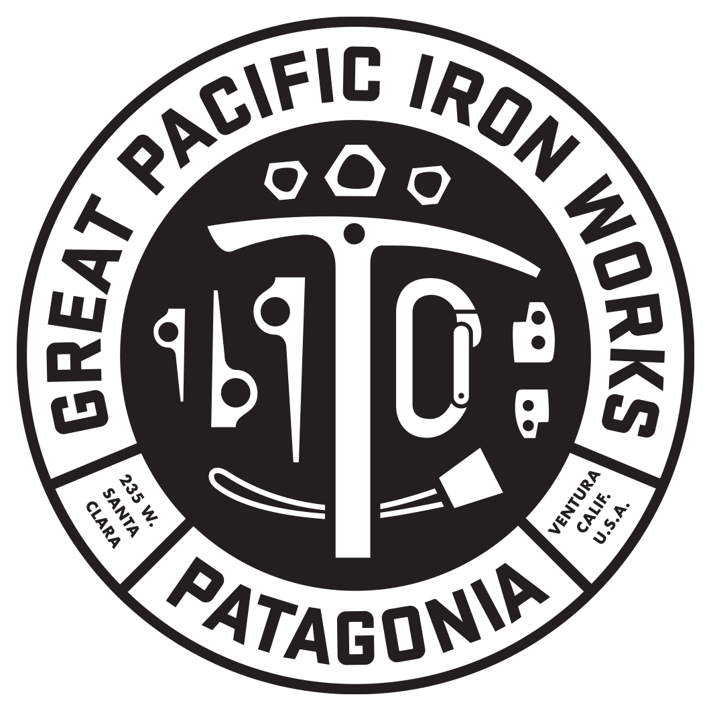
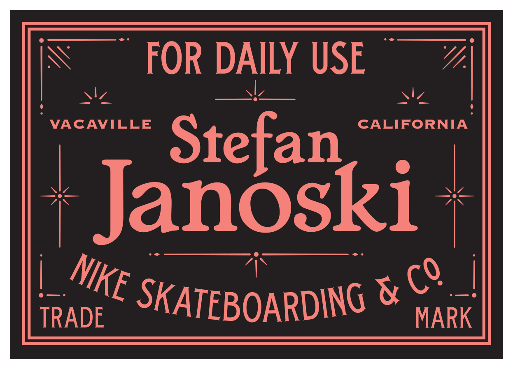
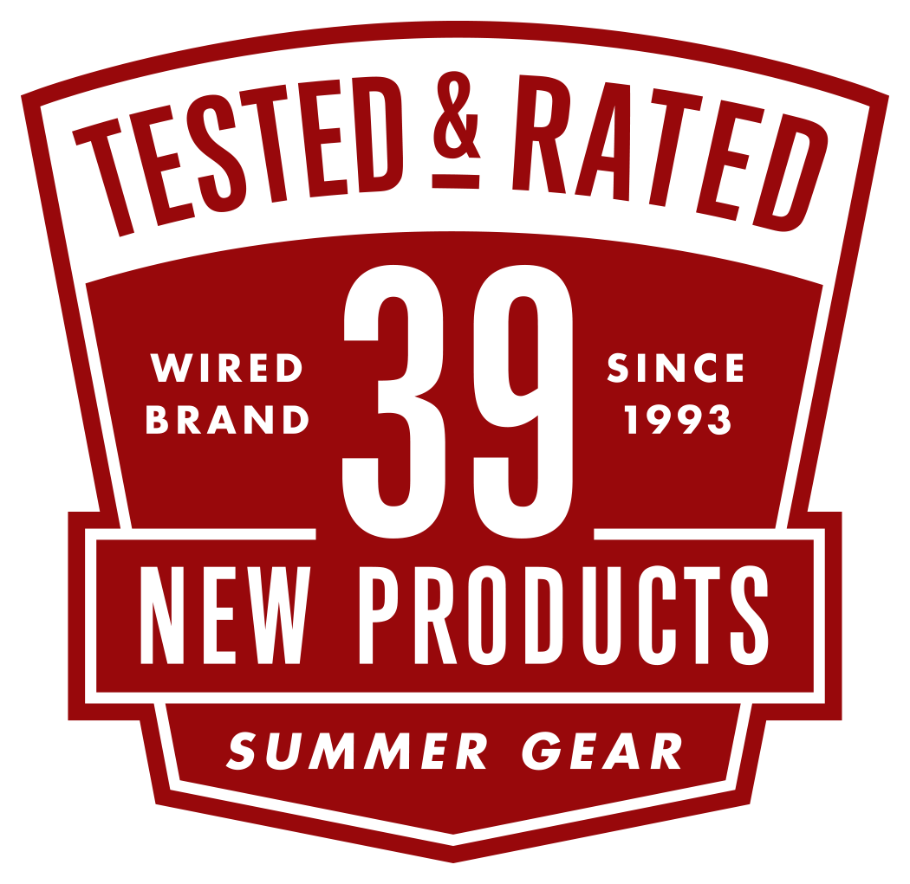

# 复古徽章 · 十例参考

十例分别按项目去重；源图、预览和裁切图不重复计数。本轮保留清晰来源，未使用 AI 清晰化。总览用于比较，逐例 PNG 与完整源文件用于看细节。

## B01 · Golden Roller Skate, 2024

圆形紫色字圈围住绿色中心与轮滑鞋，黄色文字和轮廓形成鲜明层级。

可迁移方法：将产品图形作为中心，外圈只承载必要名称与地点。

[清晰单例](references/B01.png) · [完整源文件](references/B01-original.webp) · [来源页面](https://www.draplin.com/work/logos)

作者：Aaron Draplin / Draplin Design Co.；具体合作分工未逐项核实。展示尺寸 1182×1182，来源文件 1500×1500，裁切不放大。

## B02 · Carryology × Unbound, 2023

橙底圆章内有正面角色、放射状线条和顶端弧排字，中心图形较密。

可迁移方法：先保证大轮廓，再控制内部线条密度；不把角色细节直接迁移。

[清晰单例](references/B02.png) · [完整源文件](references/B02-original.webp) · [来源页面](https://www.draplin.com/work/logos)

作者：Aaron Draplin / Draplin Design Co.；具体合作分工未逐项核实。展示尺寸 1121×1121，来源文件 1500×1500，裁切不放大。

## B03 · Phish Summer Badge, 2021

黄黑外圈承载活动文字，内部用太阳、云、山和水的分区构图。

可迁移方法：以不同区域表达场景，留出文字与主图之间的边界。

[清晰单例](references/B03.png) · [完整源文件](references/B03-original.webp) · [来源页面](https://www.draplin.com/work/logos)

作者：Aaron Draplin / Draplin Design Co.；具体合作分工未逐项核实。展示尺寸 1118×1118，来源文件 1500×1500，裁切不放大。

## B04 · Walrus Oil, 2021

黑色字圈包住白底海象线描，文字沿环形阅读，形成黑白强对照。

可迁移方法：将动物主图与信息圈分层，密集小字另做尺寸适配。

[清晰单例](references/B04.png) · [完整源文件](references/B04-original.webp) · [来源页面](https://www.draplin.com/work/logos)

作者：Aaron Draplin / Draplin Design Co.；具体合作分工未逐项核实。展示尺寸 1202×1202，来源文件 1500×1500，裁切不放大。

## B05 · Department of Sandwich, 2019

蓝白圆章以弧形字圈包住正面人物和托盘，并用 PDX / ORE 补充位置。

可迁移方法：建立主名称、地点与中心图的独立层级。

[清晰单例](references/B05.png) · [完整源文件](references/B05-original.webp) · [来源页面](https://www.draplin.com/work/logos)

作者：Aaron Draplin / Draplin Design Co.；具体合作分工未逐项核实。展示尺寸 1064×1064，来源文件 1500×1500，裁切不放大。

## B06 · Made Right Here, 2014

盾形上下色块与三行粗字组合，白星点缀，底部收尖。

可迁移方法：研究文字本身填充盾牌宽度的方式，配色与星形按新品牌需要选择。

[清晰单例](references/B06.png) · [完整源文件](references/B06-original.webp) · [来源页面](https://www.draplin.com/work/logos)

作者：Aaron Draplin / Draplin Design Co.；具体合作分工未逐项核实。展示尺寸 993×967，来源文件 1500×1500，裁切不放大。

## B07 · Coal Headwear Hold Fast, 2012

盾牌内的锚、交叉物件、弧字和带状横条共同形成户外徽章。

可迁移方法：只选主题所需物件，分清外框、中心轴和横向信息带。

[清晰单例](references/B07.png) · [完整源文件](references/B07-original.webp) · [来源页面](https://www.draplin.com/work/logos)

作者：Aaron Draplin / Draplin Design Co.；具体合作分工未逐项核实。展示尺寸 1123×1108，来源文件 1500×1500，裁切不放大。

## B08 · Patagonia Great Pacific Iron Works, 2010

黑白圆章用外圈长名称包围中心竖向器具构图，下缘加入品牌文字。

可迁移方法：用字圈容纳较长名称，同时为中心图保留独立轮廓。

[清晰单例](references/B08.png) · [完整源文件](references/B08-original.webp) · [来源页面](https://www.draplin.com/work/logos)

作者：Aaron Draplin / Draplin Design Co.；具体合作分工未逐项核实。展示尺寸 1061×1061，来源文件 1500×1500，裁切不放大。

## B09 · Nike Stefan Janoski, 2008

横向矩形细边框内，以大字姓名、较小说明和角部细节形成标签式结构。

可迁移方法：通过字号与边框形成层级；不依赖圆形或盾形才能构成徽章。

[清晰单例](references/B09.png) · [完整源文件](references/B09-original.webp) · [来源页面](https://www.draplin.com/work/logos)

作者：Aaron Draplin / Draplin Design Co.；具体合作分工未逐项核实。展示尺寸 1246×898，来源文件 1500×1500，裁切不放大。

## B10 · Wired Tested & Rated, 2002

红白盾形标签以大号数字为中心，顶端弧字与中部横条分隔信息。

可迁移方法：在数字、主标题和副说明间确定唯一主焦点。

[清晰单例](references/B10.png) · [完整源文件](references/B10-original.webp) · [来源页面](https://www.draplin.com/work/logos)

作者：Aaron Draplin / Draplin Design Co.；具体合作分工未逐项核实。展示尺寸 1050×1021，来源文件 1500×1500，裁切不放大。

## 使用边界

上述为可见特征的整理与评论。原字体、作者未说明的语义和具体委托/采用状态不补编；来源页的年份按其标签记录。生成迁移尚未验证。字段、文件校验与清晰度判断见 [sources.json](sources.json)，使用方法见 [STYLE.md](STYLE.md)。
