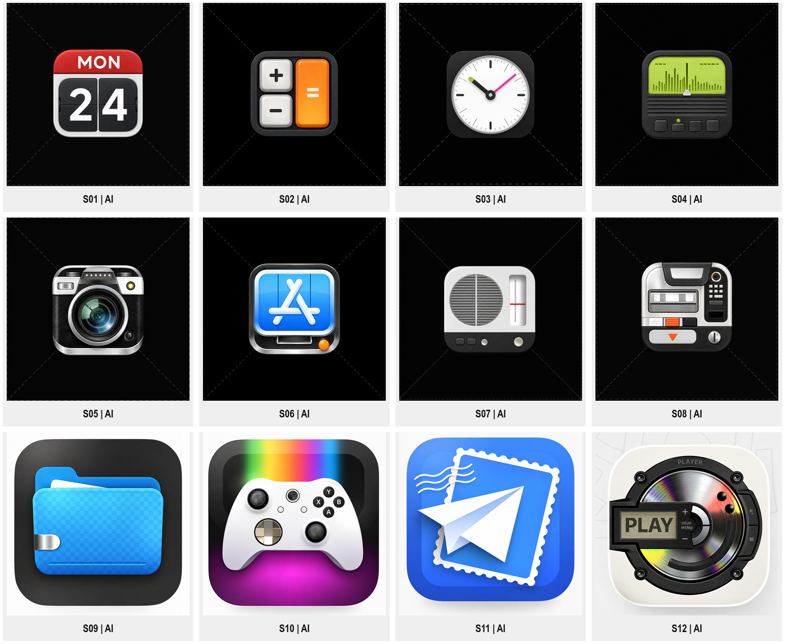
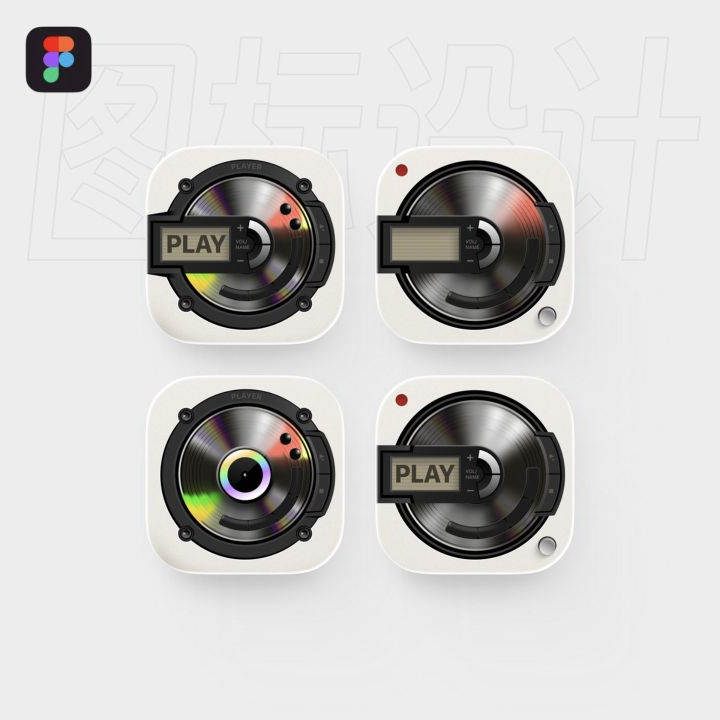

# 复古精密拟物

当用户希望品牌标志像一件可触摸的小设备，或参考中出现实体按键、金属框、屏幕、旋钮、镜片和纸张结构时，使用本包。只有需要灰阶体积、抽象圆润符号或角色表情时，应同时比较其他包，不能自动添加机械零件。优先遵循用户任务与上层规则；外部作品只作为参考。

本名称用于描述样本，英文可写 **retro skeuomorphic icon design**。作者在 [拟物研究帖](https://x.com/Kubai087/status/2062174479225372687)中明确将早期作品称为 skeuomorphic studies，并说明其中包含知名产品 Logo 的拟物版本；[CD 播放器帖](https://x.com/Kubai087/status/1976624493746602204)也明确称其为拟物风格。不能由此将原品牌的商标作者归给本合集作者。

完整的 [12 个案例](EXAMPLES.md)包含日历、计算器、时钟、频谱仪表、相机、App Store 拟物化、扬声器、多仓格设备面板、Files、Arcade、Mail 与 CD 播放器。它们是不同主体的研究参考，不代表十二个原创品牌或十二件已上线产品。

## 核心识别方法

**把功能或品牌主体变成一件缩微实体，再通过部件关系和材料分区解释它。** 这类图形的体积不是统一加一层投影：键帽、凹槽、镜头、纸张与发光屏幕各自有不同表现。

| 层面 | 样本中的可见方法 | 迁移时的操作 |
| --- | --- | --- |
| 构思 | 日历、镜头、游戏手柄、唱片等可辨的功能主体 | 先选与新品牌有关的主体及唯一主焦点 |
| 形状 | 大部件套小部件，壳体包住功能区 | 先画壳体与主体，再加确有意义的控制细节 |
| 深度 | 屏幕下陷、键帽凸起、镜圈套叠、纸张折叠 | 明确哪些面在前、哪些面在后，避免相互矛盾 |
| 材料 | 金属边框、塑料外壳、玻璃屏幕、纸张、织纹 | 每个部件指定材料；不把全图都处理成同一种亮塑料 |
| 光照 | 边缘高光、部件间遮挡阴影、局部彩色反射 | 先统一主光，再为特定材料添加可解释的反射 |
| 色彩 | 深壳体与白/金属面建立层级，再由橙、蓝、绿等强调功能 | 先建立亮暗关系，再选与品牌相符的强调色 |
| 字样 | 日期、PLAY、算符与读数参与功能语义 | 精确文字用真实排版或矢量重建；微细文字按尺寸删减 |

上表是视觉归纳，不是对每个作品制作工具或真实材质的鉴定。作者有 Figma 绘制说明；不能因此宣称所有案例都是 3D 渲染，也不能把 Figma 规定为唯一工具。

## 锚点：CD 播放器

可见关系是圆形唱片、黑色框架、横向显示模块与浅色圆角底板。圆盘上有径向灰阶、彩色反光，框架有螺钉式小点；局部细节丰富，但唱片仍是主形。四个版本更改中心、框架和显示模块，属于一个主体的版本探索，只计一例。

迁移时，先决定新品牌需要的是圆盘、卷轴还是其他机构。借用“材料分区与部件层次”的方法，不沿用唱片、螺钉与 PLAY 的整套组合。彩虹反光仅是该材料的表现候选，不是所有拟物标志的固定要求。

## 参数与执行顺序

1. 从产品用途、名称或操作中选一个可辨主体，写出对应理由。
2. 确定主形、辅助部件、载体与观察角度；先检查无纹理时是否成立。
3. 分配材料、凹凸与主光，检查遮挡和投影是否一致。
4. 按目标尺寸添加纹理、刻度、文字和控制点，禁止先堆细节再寻找主形。
5. 制作新品牌候选并检查独立识别；需要平面版时，从确定的可编辑母版另做适配。

可调参数包括部件数量、观察角度、倒角宽度、材料粗糙度、反光强度、发光区域、纹理密度、阴影范围与画布占比。数值根据任务确定，本包没有测得原作品的官方参数。

## 验证与交付边界

使用 [PROMPTS.md](PROMPTS.md) 时替换全部字段，并指出参考只承担哪一种角色。实际输出至少检查：主体语义、前后层次、光照一致性、文字准确性、目标尺寸、与第三方品牌的区别。真实系统图标及印刷交付还需单独验证对应规范。

本包已目检参考并保存来源。浏览器截图保留为采集证据，预览是按可见图像边界裁切的版本；不是远程原作品文件。默认展示已目检的 AI 清晰化图，并保留采集图供对照。清晰化图用于形状与材料层级研究，模型补出的微纹理、小控件及背景线不能作为原作者细节或字体的证据。已实际执行参考清晰化；风格 Prompt 的新品牌生成、跨品牌迁移、印刷和平台适配未验证，状态为 `provisional`。
