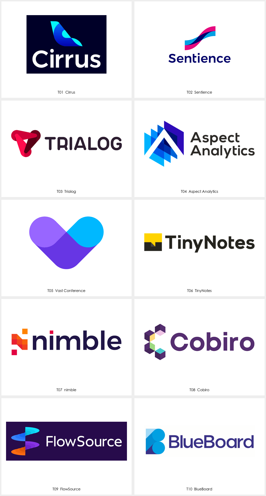
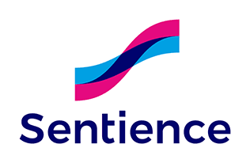

# Alex Tass · 科技语义与字母融合参考

本页展示第三方来源作品，不是 Agent 新生成样张。计数：10 个具名产品/项目；同名方案与品牌延展只计一次，客户采用状态未逐项核实。每例保留来源与默认展示入口；来源版本和本库裁切不重复计数。

[风格方法](STYLE.md) · [Prompt](PROMPTS.md) · [完整来源记录](sources.json)

## T01 · Cirrus

[打开单例](references/T01.png) · [完整预览](references/T01-src-preview.png) · [原采集文件](references/T01-src-original.png) · [来源页面](https://alextass.com/portfolio/logofolio-logo-design-portfolio/)

- 观察：C 形带状轮廓结合尾翼式尖角，蓝青渐变划分折转，上下组合白色名称。
- 迁移：适合研究首字母与具体服务动作合成；飞行意象只迁移到有相应业务含义的品牌。
- 归属与状态：Alex Tass 作者官网作品；AI 航班票务；作者 alt 标注 C 与 airplane tail fin。 具体采用与现用状态未核实。
- 图像：来源解码后裁切，保持主体像素；未使用 AI 清晰化。

## T02 · Sentience

[打开单例](references/T02.png) · [完整预览](references/T02-src-preview.png) · [原采集文件](references/T02-src-original.png) · [来源页面](https://alextass.com/portfolio/logofolio-logo-design-portfolio/)

- 观察：两条蓝色与洋红色波带共同形成上扬 S 形，交叠处为深色；完整图另有重复图案。
- 迁移：用两种信息的交汇表达转换关系，再检验新首字母是否成立；重复图案作为延展。
- 归属与状态：Alex Tass 作者官网作品；机器学习翻译应用；作者 alt 标注 S monogram。 具体采用与现用状态未核实。
- 图像：来源解码后裁切，保持主体像素；未使用 AI 清晰化。

## T03 · Trialog

[打开单例](references/T03.png) · [完整预览](references/T03-src-preview.png) · [原采集文件](references/T03-src-original.png) · [来源页面](https://alextass.com/portfolio/logofolio-logo-design-portfolio/)

- 观察：三段圆头带状结构围成三角与中央留白，红色深浅划分交叠。
- 迁移：研究多个参与方汇合的关系；先检验新产品确有此语义，再决定是否保留三向结构。
- 归属与状态：Alex Tass 作者官网作品；AI 软件；作者 alt 标注三股动态力量形成 T；视觉阅读可能先感知三角。 具体采用与现用状态未核实。
- 图像：来源解码后裁切，保持主体像素；未使用 AI 清晰化。

## T04 · Aspect Analytics

[打开单例](references/T04.png) · [完整预览](references/T04-src-preview.png) · [原采集文件](references/T04-src-original.png) · [来源页面](https://alextass.com/portfolio/logofolio-logo-design-portfolio/)

- 观察：蓝色分层平面组成竖向图形，中央白色斜向开口构成 A 的主要阅读线索。
- 迁移：研究首字母与数据分层关系；缩小时先减少层数并保护主开口。
- 归属与状态：Alex Tass 作者官网作品；成像质谱数据分析；沿用作者 alt。 具体采用与现用状态未核实。
- 图像：来源解码后裁切，保持主体像素；未使用 AI 清晰化。

## T05 · Vast Conference

[打开单例](references/T05.png) · [完整预览](references/T05-src-preview.png) · [原采集文件](references/T05-src-original.png) · [来源页面](https://alextass.com/portfolio/logofolio-logo-design-portfolio/)

- 观察：两个圆头斜向色面在底部相接成 V，交叠区域为深紫色。
- 迁移：从沟通双方的汇合关系构造首字母；保持单色时也能读出外轮廓。
- 归属与状态：Alex Tass 作者官网作品；电话会议；作者 alt 标注 V 与 connecting communicating people。 具体采用与现用状态未核实。
- 图像：来源解码后裁切，保持主体像素；未使用 AI 清晰化。

## T06 · TinyNotes

[打开单例](references/T06.png) · [完整预览](references/T06-src-preview.png) · [原采集文件](references/T06-src-original.png) · [来源页面](https://alextass.com/portfolio/logofolio-logo-design-portfolio/)

- 观察：黄黑方块内以斜角缺口构成折页/对话式细节，旁边为粗重黑色名称。
- 迁移：将笔记、对话等一个核心动作压缩进紧凑轮廓；检查小尺寸下转折是否消失。
- 归属与状态：Alex Tass 作者官网作品；协作笔记应用；作者 alt 标注 T、N、chat 和 folded note，多重含义不是小尺寸已验证事实。 具体采用与现用状态未核实。
- 图像：来源解码后裁切，保持主体像素；未使用 AI 清晰化。

## T07 · nimble

[打开单例](references/T07.png) · [完整预览](references/T07-src-preview.png) · [原采集文件](references/T07-src-original.png) · [来源页面](https://alextass.com/portfolio/logofolio-logo-design-portfolio/)

- 观察：橙红方块与斜向拼接组成 N 式图形，分离小方块与字样圆点产生呼应。
- 迁移：用有限模块表达搭建或灵活组合，先让字母骨架成立，再决定是否需要游离小块。
- 归属与状态：Alex Tass 作者官网作品；应用开发；作者 alt 标注 N letter mark。 具体采用与现用状态未核实。
- 图像：来源解码后裁切，保持主体像素；未使用 AI 清晰化。

## T08 · Cobiro

[打开单例](references/T08.png) · [完整预览](references/T08-src-preview.png) · [原采集文件](references/T08-src-original.png) · [来源页面](https://alextass.com/portfolio/logofolio-logo-design-portfolio/)

- 观察：多个立方体式色面围成开口 C；完整图将同类模块放大为周边图案。
- 迁移：研究可组合模块与建站功能的关系；图标阶段减少模块内部细分，保留开口。
- 归属与状态：Alex Tass 作者官网作品；网站构建工具；作者 alt 标注 C、boxes、modules。 具体采用与现用状态未核实。
- 图像：来源解码后裁切，保持主体像素；未使用 AI 清晰化。

## T09 · FlowSource

[打开单例](references/T09.png) · [完整预览](references/T09-src-preview.png) · [原采集文件](references/T09-src-original.png) · [来源页面](https://alextass.com/portfolio/logofolio-logo-design-portfolio/)

- 观察：彩色横向椭圆片沿竖轴错位交叠，形成带状旋转结构，配合浅色横向名称。
- 迁移：用层叠与流向表达信息流转；字母融合是否可读需单独验证，不能靠解释代替识别。
- 归属与状态：Alex Tass 作者官网作品；效率应用；作者 alt 标注 fs monogram。 具体采用与现用状态未核实。
- 图像：来源解码后裁切，保持主体像素；未使用 AI 清晰化。

## T10 · BlueBoard

[打开单例](references/T10.png) · [完整预览](references/T10-src-preview.png) · [原采集文件](references/T10-src-original.png) · [来源页面](https://alextass.com/portfolio/logofolio-logo-design-portfolio/)

- 观察：竖向矩形与上下圆形组合成 B，蓝色斜向分区形成层次。
- 迁移：从一个强字母骨架起步，将板面或信息分区作为次级含义，避免依赖颜色才读出字母。
- 归属与状态：Alex Tass 作者官网作品；AI 实时营销工具；沿用作者 alt。 具体采用与现用状态未核实。
- 图像：来源解码后裁切，保持主体像素；未使用 AI 清晰化。

